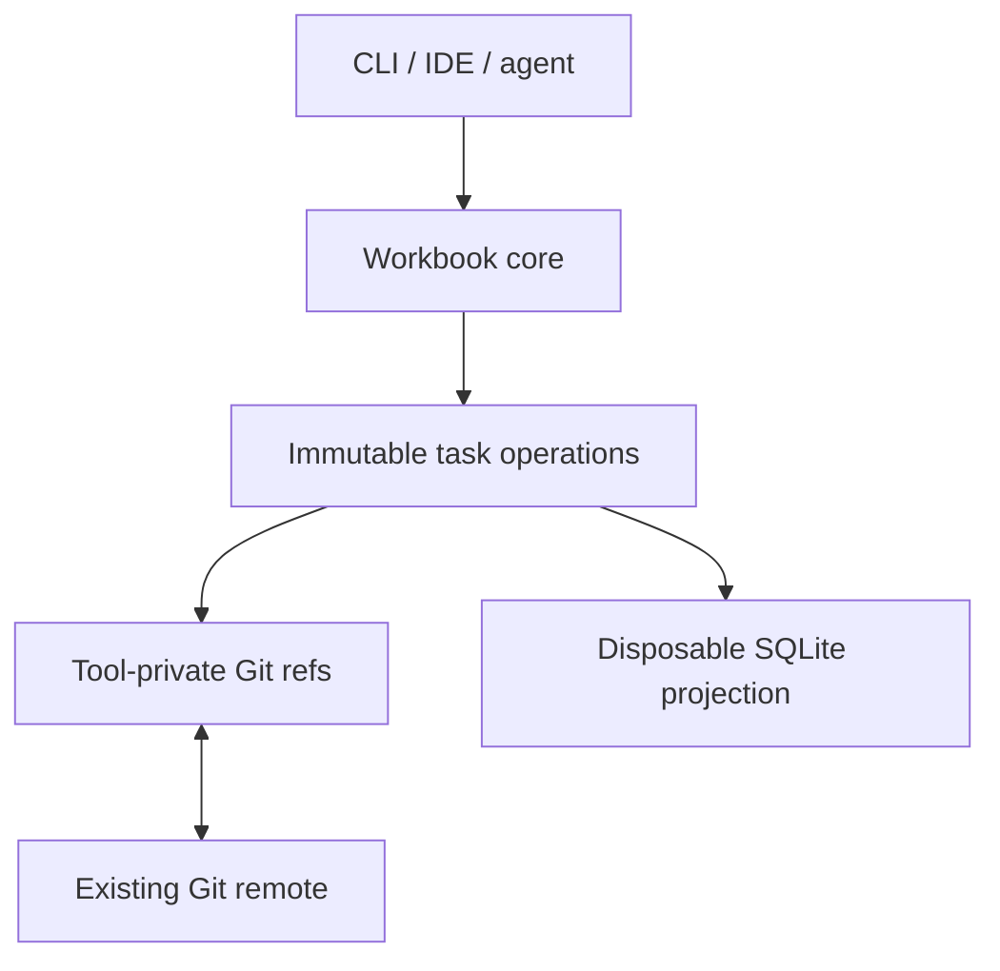

# Workbook

Workbook is a lightweight, repository-native project tracker for humans and coding agents.

The goal is to keep structured project state close to the code without requiring a hosted issue tracker. A local CLI provides task operations and fast queries, Git provides durable synchronization, and SQLite provides a disposable materialized view.

> **Status:** design and prototyping. The commands and formats below describe the intended architecture; they are not implemented yet.

## Why Workbook?

`TODO.md` files travel with a repository and are easy for agents to read, but they lack structure, validation, dependency modeling, useful queries, and safe concurrent updates. Hosted trackers provide that rigor, but introduce another account, API, network dependency, and source of context that can drift away from the code.

Workbook aims for a middle ground:

- project state travels through the same Git remote as the code;
- developers can clone a repository and bootstrap with one command;
- agents can discover, claim, and update work through a small CLI with JSON output;
- task history is append-only, inspectable, and mergeable;
- no hosted service or MCP server is required for the default workflow;
- SQLite enables efficient local filtering, search, dependency queries, and projections.

## Target workflows

### Solo development

A developer keeps task state in the repository's Git object database and queries it locally. A remote is optional, although pushing Workbook refs provides backup and portability across clones.

### Small teams

Team members share task operations through the repository's existing Git remote. Workbook synchronizes only its own refs, automatically reconciles concurrent edits, and does not modify or push a developer's code branch.

Onboarding should be approximately:

```sh
git clone <repository>
./init.sh
workbook ready
```

### Ephemeral coding agents

A fresh VM or sandbox clones the repository, bootstraps Workbook, claims a task using a remote compare-and-swap, reads the relevant context, implements the work, and records the resulting commit before the environment is discarded.

A proposed flow is:

```sh
git clone <repository>
./init.sh

workbook claim TASK-123 --remote-required --json
workbook show TASK-123 --json

# Implement and commit the work.

workbook finish TASK-123 --commit HEAD --push --json
```

## Architecture

Workbook separates its data model, transport, and query engine:



| Layer | Responsibility |
| --- | --- |
| Operation model | Defines task history, causality, validation, and merge semantics |
| Git refs and objects | Durably store and synchronize operations |
| SQLite | Materializes current task state for fast local queries |
| CLI/core library | Owns synchronization, validation, projection, and user-facing operations |
| Optional adapters | IDE integrations, local API, MCP, or a coordination relay |

The working tree contains only bootstrap configuration and documentation. Task state does not live on the currently checked-out code branch.

## Git storage model

Each task owns a custom Git ref:

```text
refs/workbook/tasks/TASK-123
refs/workbook/tasks/TASK-456
```

The ref points to a Git **commit object**. That commit is the current head of the task's operation DAG:

```text
ref
 └── commit
      ├── parent commit(s)
      └── tree
           ├── operation.json blob
           └── optional attachment blobs
```

- The root commit has no parents and contains `task.create`.
- A normal edit commit has one parent.
- A reconciliation or resolution commit can have multiple parents.
- Git parent edges define causal history.
- The commit tree contains only that edit's operation pack, not a full task snapshot.
- The complete task is reconstructed by traversing all commits reachable from its ref.

Using one ref per task avoids a single global state-branch bottleneck: agents working on different tasks update different refs. Concurrent edits to the same task form branches in that task's operation DAG and are merged according to Workbook's domain rules.

### Operation pack

One CLI action creates one versioned operation pack. A pack can hold multiple operations that should be applied atomically:

```json
{
  "format": "workbook.operation-pack",
  "version": 1,
  "taskId": "TASK-123",
  "actor": {
    "id": "agent-7"
  },
  "logicalClock": 18,
  "wallTime": "2026-07-22T14:35:00-04:00",
  "operations": [
    {
      "id": "01K0M6B8A4FTT8C39MXXYTW7C2",
      "type": "implementation.link",
      "commit": "da73c0..."
    },
    {
      "id": "01K0M6B8A4FTT8C39MXXYTW7C3",
      "type": "field.set",
      "field": "status",
      "value": "implemented"
    }
  ]
}
```

Operation IDs are globally unique and independent of Git object IDs. Git commit ancestry provides causal ordering; a logical clock assists validation and deterministic presentation. Wall-clock time is for display only and must not decide semantic conflicts.

The initial format is expected to support operations such as:

- `task.create` and `task.tombstone`;
- `field.set` for title, status, priority, and other scalar fields;
- `set.add` and `set.remove` for labels and dependencies;
- `comment.add`;
- `claim.acquire`, `claim.release`, and heartbeat/lease operations;
- `implementation.link` for associating work with code commits.

Historical operation commits are immutable. Tasks are tombstoned rather than deleting their refs, and shared task histories are merged rather than rebased or force-pushed.

## Concurrency and synchronization

Workbook follows a local-first, operation-based model:

1. Fetch the relevant Workbook ref.
2. Merge any newly discovered operation DAGs.
3. Validate the requested transition against the projected task.
4. Write an operation pack and Git commit.
5. Atomically advance the local task ref.
6. Push that task ref.
7. If the remote changed concurrently, fetch, reconcile, and retry.

Most operations can converge through CRDT-inspired merge rules. Meaningful contradictions should be surfaced rather than silently hidden. For example, concurrent `done` and `blocked` status changes may produce a multi-value conflict that requires an operation causally following both values.

Exclusive claims are different. When `--remote-required` is used, a claim succeeds only after the remote accepts a fast-forward update based on the task ref that was fetched. If another agent claimed the task first, Workbook refetches and reports that the claim failed instead of merging two exclusive claims. Offline claims, if supported, must be visibly tentative.

Workbook must not rely on Git hooks for correctness. Hooks may refresh caches, add commit trailers, or warn about unsynchronized operations, but fresh clones, alternate Git clients, and remote PR merges cannot be assumed to execute them.

## Relationship to code branches

Workflow state and code availability are separate facts.

A task operation can record an implementation commit, while Workbook computes whether that implementation is reachable from the current branch or the configured target branch. This supports states such as:

- implemented on a feature branch but not landed;
- landed on `main`;
- done globally but absent from the currently checked-out historical branch.

Commit trailers provide a stable link across squash merges and cherry-picks:

```text
Task: TASK-123
```

Facts Git can derive, such as whether work has landed on `main`, should not be duplicated as mutable tracker state.

## SQLite projection

SQLite is a local cache and query engine, never the canonical source of truth. It may contain normalized tables for tasks, dependencies, labels, comments, implementation links, full-text search, and projection metadata.

The database can be deleted and rebuilt entirely from Workbook refs. Direct SQL writes to projected state are unsupported and will be lost during reconstruction.

A projected task records the Git object ID of the task head from which it was built. If the ref has not moved, the cache is current. When it moves, Workbook applies newly reachable operations or rebuilds that task's projection.

## Bootstrap and portability

A normal Git clone does not fetch arbitrary custom ref namespaces. A tracked bootstrap configuration and `init.sh` should therefore:

1. install or discover the Workbook CLI;
2. detect the repository and its remote;
3. explicitly fetch `refs/workbook/*`;
4. build the SQLite projection;
5. verify read access and, when requested, write access;
6. install optional convenience hooks.

The default shared backend uses custom refs because they avoid branch switching and per-repository head contention. A conventional `workbook/state` branch may be offered as a compatibility fallback for Git hosts that reject custom refs. A future optional relay may provide strict leases, heartbeats, notifications, or high-concurrency agent coordination while retaining the same operation model.

## Design principles

- **Repository-native:** use the existing Git repository and remote.
- **Local-first:** remain useful offline; synchronize explicitly and transparently.
- **CLI-first:** every capability is available without a GUI or long-running server.
- **Agent-friendly:** stable semantic commands and machine-readable output minimize context and token use.
- **Human-inspectable:** operation payloads use versioned, inspectable formats.
- **Derived when possible:** do not duplicate facts already represented by Git.
- **No hidden rewrites:** shared history is append-only and never force-pushed.
- **Progressive complexity:** no service is required for the default workflow; stronger coordination can be optional.

## Non-goals

At least initially, Workbook is not intended to provide:

- a hosted Jira or Linear replacement;
- organization-wide portfolio planning across many repositories;
- real-time collaborative rich-text editing;
- strict distributed leases without an online coordination authority;
- a required MCP server or IDE integration;
- field-level permissions beyond the repository's Git access controls.

## Proposed roadmap

1. Specify the operation-pack schema and task projection rules.
2. Prototype Git object/ref creation, fetching, merging, and pushing.
3. Implement deterministic SQLite projection and rebuilds.
4. Build the core CLI with structured JSON output.
5. Add remote-required claiming and conflict tests.
6. Add bootstrap configuration and a one-command repository initializer.
7. Explore IDE, local API, and MCP adapters after the CLI is stable.
8. Evaluate an optional coordination relay only when real workloads require it.

## Open questions

- Implementation language and distribution format.
- Human-facing task ID format versus globally unique internal IDs.
- Exact status workflow and customization model.
- Per-field CRDT and conflict-resolution semantics.
- Actor identity and optional operation signing.
- Attachment limits and storage policy.
- Snapshotting and compaction without rewriting shared history.
- Git-host compatibility and fallback behavior.
- Lease expiration and abandoned-agent recovery.
- Atomic publication of code refs and Workbook refs.

## Related work

- [git-bug](https://github.com/git-bug/git-bug) stores distributed issue operations in Git objects under per-entity refs.
- [Fossil](https://fossil-scm.org/) synchronizes ticket-change artifacts and reconstructs SQL tables as projections.
- [Beads](https://github.com/gastownhall/beads) explores dependency-aware task memory for coding agents.
- [Automerge](https://automerge.org/) and [Yjs](https://yjs.dev/) provide general-purpose CRDT models for local-first collaboration.

Workbook's intended distinction is a small, repository-adjacent tracker designed equally for humans, small development teams, and ephemeral coding agents.
