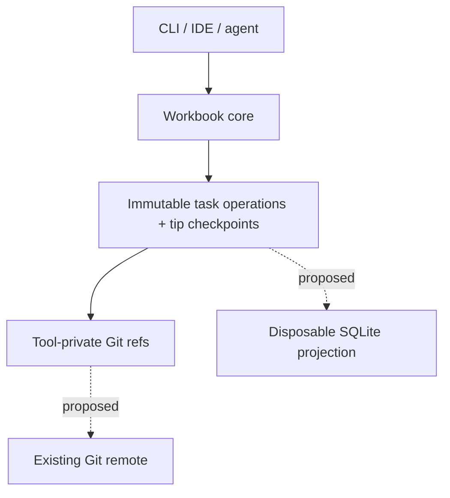

# Workbook

Workbook is a lightweight, repository-native project tracker for humans and coding agents.

The goal is to keep structured project state close to the code without requiring
a hosted issue tracker. The current local CLI stores task operations durably in
Git objects and refs. The intended architecture adds Git-remote synchronization
and a disposable SQLite materialized view.

> **Status:** initial local POC. Repository initialization and local task CRUD are
> implemented on the POC branch. Task ordering, SQLite projection, terminal and
> web boards, remote synchronization, and packaged distribution remain proposed.

## Why Workbook?

`TODO.md` files travel with a repository and are easy for agents to read, but they lack structure, validation, dependency modeling, useful queries, and safe concurrent updates. Hosted trackers provide that rigor, but introduce another account, API, network dependency, and source of context that can drift away from the code.

Workbook aims for a middle ground:

- project state travels through the same Git remote as the code;
- developers can clone a repository and bootstrap with one command;
- agents can discover, claim, and update work through a small CLI with JSON output;
- task history is append-only, inspectable, and mergeable;
- no hosted service or MCP server is required for the default workflow;
- SQLite enables efficient local filtering, search, dependency queries, and projections.

## Target workflows

### Solo development

A developer keeps task state in the repository's Git object database and queries it locally. A remote is optional, although pushing Workbook refs provides backup and portability across clones.

### Proposed small-team workflow

A future remote workflow would let team members share task operations through the
repository's existing Git remote. Workbook would synchronize only its own refs,
reconcile concurrent edits according to documented domain rules, and leave each
developer's code branch untouched.

The proposed onboarding flow would be approximately:

```sh
git clone <repository>
./init.sh
workbook ready
```

### Proposed ephemeral coding-agent workflow

A future ephemeral-agent workflow would clone the repository, bootstrap Workbook,
claim a task using a remote compare-and-swap, read the relevant context, implement
the work, and record the resulting commit before the environment is discarded.

The proposed command flow is:

```sh
git clone <repository>
./init.sh

workbook claim TASK-123 --remote-required --json
workbook show TASK-123 --json

# Implement and commit the work.

workbook finish TASK-123 --commit HEAD --push --json
```

## Source installation prerequisites

The current POC builds from source and requires Go 1.26 or newer and Git to be
available on `PATH`. Install it with:

```sh
./scripts/install.sh
```

The script accepts an optional destination directory, defaults to
`$HOME/.local/bin`, creates the destination when needed, and builds the
`workbook` executable there. It prints the installed path and, when necessary,
the `PATH` export needed to run it.

## Implemented POC commands

The current CLI implements these six local commands. Each supports human-readable
output and a machine-readable `--json` mode:

```text
workbook init
workbook create
workbook list
workbook show
workbook update
workbook delete
```

`workbook init` creates a tracked `.workbook/config.json` with the project ID and
key. Create, update, and delete append immutable task commits under
`refs/workbook/tasks/`; delete records a tombstone instead of removing the ref.
List and show read the current task checkpoint from each task ref's tip. The
current POC does not yet implement dependency-aware ordering, SQLite, terminal or
web boards, remote operations, claims, or implementation links.

### Project identity across worktrees

`.workbook/config.json` remains the portable tracked configuration that carries a
Workbook project's identity across clones. Workbook also records that identity in
a private guard at `<git-common-dir>/workbook/project.json`. The guard is private
coordination metadata shared by every worktree attached to the same common Git
directory; it does not replace the tracked configuration or travel with a clone.

The current POC permits one Workbook project per common Git repository, including
all linked worktrees. Every configuration load compares the portable configuration
with the common guard, and Workbook rejects repository use when the tracked and
common identities do not match. For repositories initialized before the guard was
introduced, the first configuration load or repeated `workbook init` atomically
backfills the missing guard from `.workbook/config.json`. Concurrent first users
must either publish that same identity or observe and validate the identity another
user published.

## Proposed post-POC commands

The following examples describe future remote coordination and are not implemented:

```sh
workbook claim TASK-123 --remote-required --json
workbook fetch
workbook push
workbook sync
```

Remote compare-and-swap claims, fetch/push refspec management, automatic conflict
reconciliation, and a combined `workbook finish --commit HEAD --push` flow remain
design proposals. A future packaged distribution might also support a Homebrew
installation such as the following; no tap or formula is published yet:

```sh
brew install dgoings/tap/workbook
```

## Architecture

Workbook separates its data model, transport, and query engine:



| Layer | Responsibility |
| --- | --- |
| Operation model | Defines task history, current tip checkpoints, causality, and validation |
| Git refs and objects | Currently store local task operations durably; synchronization is proposed |
| SQLite (proposed) | Will materialize current task state for fast local queries |
| CLI/core library | Currently owns initialization, local validation, CRUD, and user-facing output |
| Optional adapters (proposed) | IDE integrations, local API, MCP, or a coordination relay |

Workbook adds only tracked bootstrap configuration to the working tree. Task state
does not live on the currently checked-out code branch.

## Git storage model

Each task owns a custom Git ref:

```text
refs/workbook/tasks/TASK-123
refs/workbook/tasks/TASK-456
```

The ref points to a Git **commit object**. That commit is the current head of the task's operation DAG:

```text
ref
 └── commit
      ├── parent commit(s)
      └── tree
           ├── operation.json blob
           └── state.json blob
```

- The root commit has no parents and contains `task.create`.
- A normal edit commit has one parent.
- A future reconciliation or resolution commit can have multiple parents.
- Immutable `operation.json` packs are the authoritative record of task intent,
  and Git parent ancestry is the authoritative record of causality.
- Every current POC commit tree contains exactly the edit's versioned operation
  pack in `operation.json` and a deterministic, durable task materialization in
  `state.json`.
- Each `state.json` checkpoint must match the result of applying that commit's
  operation pack to its parent state, or to no parent state for a root commit.
- Ordinary `list` and `show` reads validate and use the tip checkpoint without
  replaying the complete history. This read optimization does not change the
  authority of the immutable operations or their Git ancestry.
- History replay and checkpoint reconstruction are reserved for later POC work.

Using one ref per task avoids a single global state-branch bottleneck: local
commands working on different tasks update different refs. Future concurrent edits
to the same task can form branches in that task's operation DAG and will require
the proposed domain reconciliation rules.

### Operation pack

Each task mutation creates one versioned operation pack. A pack can hold multiple
operations that should be applied atomically:

```json
{
  "format": "workbook.operation-pack",
  "version": 1,
  "projectId": "01K0M65GBZ8F5ZQX0VC1J8H3TP",
  "taskId": "WB-01K0M6B8A4FTT8C39MXXYTW7C1",
  "historyGeneration": "01K0M6B8A4FTT8C39MXXYTW7C2",
  "actor": {
    "id": "agent-7"
  },
  "logicalClock": 2,
  "wallTime": "2026-07-22T14:35:00-04:00",
  "operations": [
    {
      "id": "01K0M6B8A4FTT8C39MXXYTW7C3",
      "type": "field.set",
      "field": "status",
      "value": "ready"
    }
  ]
}
```

Operation IDs are globally unique and independent of Git object IDs. Git commit ancestry provides causal ordering; a logical clock assists validation and deterministic presentation. Wall-clock time is for display only and must not decide semantic conflicts.

The current POC format supports task creation, scalar and label updates, and
tombstones. Later CLI and format work is expected to add:

- dependency commands using the existing `set.add` and `set.remove` operation
  semantics;
- `comment.add`;
- `claim.acquire`, `claim.release`, and heartbeat/lease operations;
- `implementation.link` for associating work with code commits.

Historical operation commits are immutable. Tasks are tombstoned rather than deleting their refs, and shared task histories are merged rather than rebased or force-pushed.

## Concurrency and synchronization

Remote synchronization and concurrent reconciliation are proposed. The intended
local-first, operation-based model is:

1. Fetch the relevant Workbook ref.
2. Merge any newly discovered operation DAGs.
3. Validate the requested transition against the projected task.
4. Write an operation pack and Git commit.
5. Atomically advance the local task ref.
6. Push that task ref.
7. If the remote changed concurrently, fetch, reconcile, and retry.

Most operations can converge through CRDT-inspired merge rules. Meaningful contradictions should be surfaced rather than silently hidden. For example, concurrent `done` and `blocked` status changes may produce a multi-value conflict that requires an operation causally following both values.

Exclusive claims are different. When `--remote-required` is used, a claim succeeds only after the remote accepts a fast-forward update based on the task ref that was fetched. If another agent claimed the task first, Workbook refetches and reports that the claim failed instead of merging two exclusive claims. Offline claims, if supported, must be visibly tentative.

Workbook must not rely on Git hooks for correctness. Hooks may refresh caches, add commit trailers, or warn about unsynchronized operations, but fresh clones, alternate Git clients, and remote PR merges cannot be assumed to execute them.

## Relationship to code branches

Implementation links and landed-state reporting are proposed; the current POC
does not implement them. The intended model keeps workflow state and code
availability as separate facts.

A task operation can record an implementation commit, while Workbook computes whether that implementation is reachable from the current branch or the configured target branch. This supports states such as:

- implemented on a feature branch but not landed;
- landed on `main`;
- done globally but absent from the currently checked-out historical branch.

Commit trailers provide a stable link across squash merges and cherry-picks:

```text
Task: TASK-123
```

Facts Git can derive, such as whether work has landed on `main`, should not be duplicated as mutable tracker state.

## SQLite projection

The SQLite projection is proposed and is not created by the current POC. When
implemented, SQLite will be a local cache and query engine, never the canonical
source of truth. It may contain normalized tables for tasks, dependencies, labels,
comments, implementation links, full-text search, and projection metadata.

The database can be deleted and rebuilt entirely from Workbook refs. Direct SQL writes to projected state are unsupported and will be lost during reconstruction.

A projected task records the Git object ID of the task head from which it was built. If the ref has not moved, the cache is current. When it moves, Workbook applies newly reachable operations or rebuilds that task's projection.

## Bootstrap and portability

A normal Git clone does not fetch arbitrary custom ref namespaces. The implemented
`workbook init` command creates local project configuration and a private cache
directory; it does not install the CLI, fetch custom refs, build SQLite, or install
hooks. A future bootstrap command or `init.sh` should:

1. install or discover the Workbook CLI;
2. detect the repository and its remote;
3. explicitly fetch `refs/workbook/*`;
4. build the SQLite projection;
5. verify read access and, when requested, write access;
6. install optional convenience hooks.

The default shared backend uses custom refs because they avoid branch switching and per-repository head contention. A conventional `workbook/state` branch may be offered as a compatibility fallback for Git hosts that reject custom refs. A future optional relay may provide strict leases, heartbeats, notifications, or high-concurrency agent coordination while retaining the same operation model.

## Design principles

- **Repository-native:** use the existing Git repository and remote.
- **Local-first:** remain useful offline; synchronize explicitly and transparently.
- **CLI-first:** every capability is available without a GUI or long-running server.
- **Agent-friendly:** stable semantic commands and machine-readable output minimize context and token use.
- **Human-inspectable:** operation payloads use versioned, inspectable formats.
- **Derived when possible:** do not duplicate facts already represented by Git.
- **No hidden rewrites:** shared history is append-only and never force-pushed.
- **Progressive complexity:** no service is required for the default workflow; stronger coordination can be optional.

## Non-goals

At least initially, Workbook is not intended to provide:

- a hosted Jira or Linear replacement;
- organization-wide portfolio planning across many repositories;
- real-time collaborative rich-text editing;
- strict distributed leases without an online coordination authority;
- a required MCP server or IDE integration;
- field-level permissions beyond the repository's Git access controls.

## POC roadmap

The POC now has versioned operation and state documents, local Git object/ref CRUD,
structured CLI output, and repository initialization. Remaining work is:

1. Add exact task ordering, dependencies, cycle rejection, and next selection.
2. Implement deterministic SQLite projection and rebuilds from tip checkpoints.
3. Render wide and narrow terminal task tables and an ASCII board.
4. Serve a read-only web Kanban board.
5. Complete replay, reconstruction, Git hash, renderer, HTTP, installer, and
   documentation acceptance coverage.

Remote synchronization, claims, conflict reconciliation, packaged distribution,
and optional adapters follow the local POC rather than being part of it.

## Open questions

- Distribution format beyond source builds.
- Exact status workflow and customization model.
- Per-field CRDT and conflict-resolution semantics.
- Actor identity and optional operation signing.
- Attachment limits and storage policy.
- Snapshotting and compaction without rewriting shared history.
- Git-host compatibility and fallback behavior.
- Lease expiration and abandoned-agent recovery.
- Atomic publication of code refs and Workbook refs.

## Related work

- [git-bug](https://github.com/git-bug/git-bug) stores distributed issue operations in Git objects under per-entity refs.
- [Fossil](https://fossil-scm.org/) synchronizes ticket-change artifacts and reconstructs SQL tables as projections.
- [Beads](https://github.com/gastownhall/beads) explores dependency-aware task memory for coding agents.
- [Automerge](https://automerge.org/) and [Yjs](https://yjs.dev/) provide general-purpose CRDT models for local-first collaboration.

Workbook's intended distinction is a small, repository-adjacent tracker designed equally for humans, small development teams, and ephemeral coding agents.
