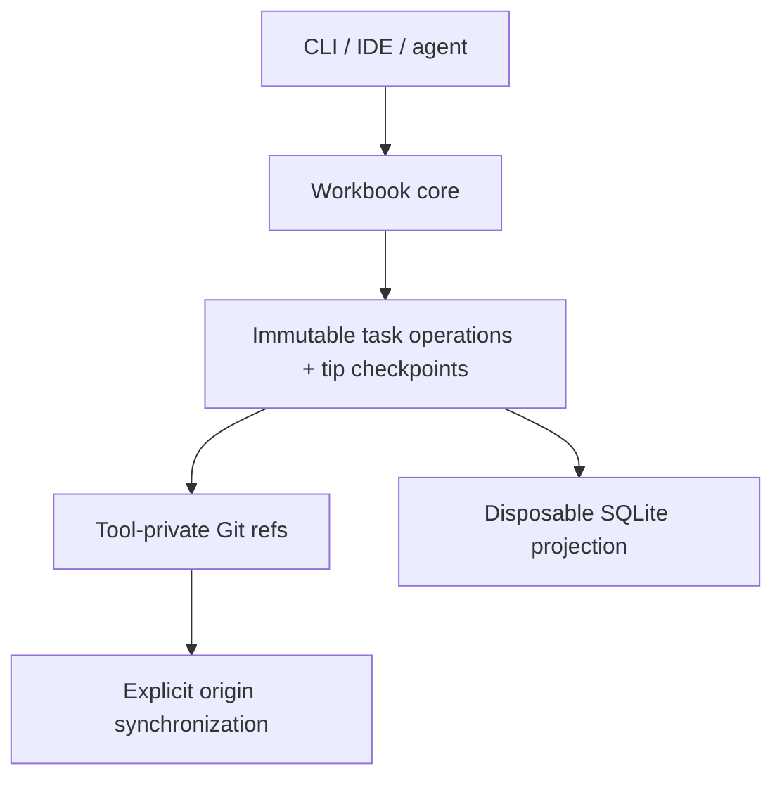

# Workbook

Workbook is a lightweight, repository-native project tracker for humans and coding agents.

The goal is to keep structured project state close to the code without requiring
a hosted issue tracker. The current CLI stores task operations durably in Git
objects and refs and explicitly synchronizes them through `origin`. A disposable
SQLite materialized view accelerates normal task reads while Git remains canonical.

> **Status:** initial collaborative POC. Repository initialization, local task
> CRUD, task ordering and dependencies, terminal and web boards, web
> drag-and-drop status changes, explicit origin-only task fetch/push/sync, and a
> disposable SQLite task projection are implemented. Conflict reconciliation
> remains proposed. Release artifact tooling exists, but no public package has
> been published yet.

## Why Workbook?

`TODO.md` files travel with a repository and are easy for agents to read, but they lack structure, validation, dependency modeling, useful queries, and safe concurrent updates. Hosted trackers provide that rigor, but introduce another account, API, network dependency, and source of context that can drift away from the code.

Workbook aims for a middle ground:

- project state travels through the same Git remote as the code;
- developers can clone a repository and bootstrap with one command;
- agents can discover, claim, and update work through a small CLI with JSON output;
- task history is append-only, inspectable, and mergeable;
- no hosted service or MCP server is required for the default workflow;
- SQLite provides efficient local task reads and filtering without becoming a
  second source of truth.

## Target workflows

### Solo development

A developer keeps task state in the repository's Git object database and queries it locally. A remote is optional, although pushing Workbook refs provides backup and portability across clones.

### Small-team workflow

Team members explicitly share task refs through the repository's `origin` remote.
Workbook fetches only its private task namespace, validates fetched task
histories and checkpoints in isolated tracking refs, and leaves the checked-out
code branch untouched.

After cloning the repository and installing Workbook, fetch the shared tasks:

```sh
git clone <repository>
./init.sh
workbook fetch
```

Publish local task changes explicitly with `workbook push`. Teams that want task
publication tied to ordinary code pushes can opt in once per clone with
`workbook hooks install`. To perform the safe fetch-then-push sequence manually,
run `workbook sync`.

### Proposed ephemeral coding-agent workflow

A future ephemeral-agent workflow would clone the repository, bootstrap Workbook,
claim a task using a remote compare-and-swap, read the relevant context, implement
the work, and record the resulting commit before the environment is discarded.

The proposed command flow is:

```sh
git clone <repository>
./init.sh

workbook claim TASK-123 --remote-required --json
workbook show TASK-123 --json

# Implement and commit the work.

workbook finish TASK-123 --commit HEAD --push --json
```

## Source installation prerequisites

The current POC builds from source and requires Go 1.26 or newer and Git to be
available on `PATH`. Install it with:

```sh
./scripts/install.sh
```

The script accepts an optional destination directory, defaults to
`$HOME/.local/bin`, creates the destination when needed, and builds the
`workbook` executable there. It prints the installed path and, when necessary,
the `PATH` export needed to run it.

Use help to discover commands and their options:

```text
workbook --help
workbook create --help
workbook help create
workbook version
```

Help output is human-readable. Help itself has no JSON form.

## Implemented POC commands

The current CLI implements these local commands. Commands marked `--json` support
both human-readable output and a versioned machine-readable result envelope:

```text
workbook init
workbook create
workbook list
workbook board [--wide | --narrow] [--json]
workbook show
workbook update
workbook delete
workbook restore
workbook move <task> (--before <task> | --after <task>) [--json]
workbook depend <task> <dependency> [--json]
workbook free <task> <dependency> [--json]
workbook next [--json]
workbook rebuild [--json]
workbook version [--json]
workbook fetch [--json]
workbook push [--json]
workbook sync [--json]
workbook hooks install [--json]
workbook serve [--addr 127.0.0.1:7331]
workbook help [command]
```

`workbook init` creates a tracked `.workbook/config.json` with the project ID and
key. Create, update, delete, and restore append immutable task commits under
`refs/workbook/tasks/`; delete records a tombstone instead of removing the ref.
Creation and ordinary updates write descriptive task-operation commit subjects
suitable for `git log`, while canonical data remains in the operation and state
blobs.
Tombstoned tasks reject every mutation except `workbook restore`, which records
an explicit append-only restore operation.
List and show read the current task checkpoint from each task ref's tip. Task
statuses follow this canonical order: Backlog, Ready, Blocked, In Progress, In
Review, and Done. `move` orders a task inside its status-and-priority bucket with
an exact rational rank; it changes only that task. `depend` adds a prerequisite
edge and rejects cycles; `free` removes one prerequisite edge and is idempotent.
`next` chooses the first Ready task whose dependencies are all active and Done,
sorting by priority, rank, and task ID; it reports no eligible task when none
qualify. `board` uses the same core task order and presents an actionable,
unambiguous task-ID prefix with each card's priority, title, and labels. Its JSON
output retains full task IDs, descriptions, and the rest of the task data. Normal
`list`, `show`, `board`, and `next` reads use the local SQLite projection.
Claims and implementation links remain future work.

### Local mutation durability

Existing-task mutations plan from the validated current state in the SQLite
projection. With a full task ID, Workbook inspects that task's exact Git ref
before planning; when the ref has advanced, Workbook validates and refreshes
that projected task from its current Git tip. Operations that need cross-task
information, such as prefix resolution, task ordering, or dependency checks,
refresh the relevant global projection first.

After planning, a state-changing mutation writes the immutable operation and
complete current state as Git objects, then synchronously compare-and-swaps the
canonical `refs/workbook/tasks/<task-id>` ref. The CLI or HTTP response reports
that state change as successful only after the Git ref advances. Workbook then
conditionally advances SQLite from the parent it observed to the new Git head,
so an older request cannot overwrite a newer projection row.

Idempotent no-ops can also return successfully without advancing Git or SQLite:
for example, removing a dependency that is already absent, adding a dependency
that is already present, or moving a task when its calculated rank is unchanged.
These responses return the already-observed task state rather than recording a
new operation.

SQLite remains a disposable read projection, not a second durability boundary.
If a successful mutation includes a `projection-update-failed` warning, the Git
mutation succeeded but the local projection could not be advanced. Subsequent
reads may repair the affected row; `workbook rebuild` recreates the projection
from the canonical Git refs when recovery is needed and reports its task count
and cache path.

### Release artifacts

`scripts/release.sh <version> <output-dir>` creates macOS Apple Silicon and
Intel archives plus a sorted `checksums.txt` file. Each archive contains only
the `workbook` executable. The script cross-compiles with the requested version
and the current Git commit injected into `workbook version`; source builds
report `dev` and `unknown` instead. Release versions must use the exact
`MAJOR.MINOR.PATCH` form without leading zeroes.

Pushing a version tag such as `v0.1.0` runs the release workflow. It tests the
strict SemVer tag, publishes the two archives and checksums to GitHub Releases,
and updates the `dgoings/homebrew-tap` formula from those generated checksums.
The protected release environment exposes a credential scoped only to that tap
repository after validation. New assets are staged in a draft, the tap update is
pushed first, and the draft is published last. A rerun verifies existing assets
byte-for-byte and never overwrites them; a failed final publication reverts the
tap update and removes only a draft created by that run.

This source repository intentionally does not track an installable
`Formula/workbook.rb` with placeholder checksums. The workflow renders the real
formula directly into the tap from the built artifacts.

### Explicit task sharing

`workbook fetch` downloads only `refs/workbook/tasks/*` from `origin` into
`refs/workbook/remotes/origin/tasks/*`. Workbook validates each fetched operation
history and its state checkpoints before touching the corresponding local task
ref. A missing local task is created, and a behind local task is fast-forwarded.
Local-ahead tasks are left alone; divergent task histories remain on their
separate local and tracking refs and are reported for later resolution. Invalid
fetched data remains isolated and causes a nonzero exit.

`workbook push` publishes every local `refs/workbook/tasks/*` ref to `origin`
without force or deletion. Each task is pushed independently, so an unrelated
task can publish even when another task is rejected as non-fast-forward. The
command reports every outcome and exits nonzero if any ref is rejected.

`workbook hooks install` opts the clone into automatic task publication during
an ordinary `git push origin`. The managed pre-push hook is recursion-safe and
blocks the code push when Workbook task publication fails. Installation is
idempotent for Workbook-managed hooks. An existing non-Workbook pre-push hook is
never overwritten; Workbook instead prints manual chaining guidance. Hooks are
optional convenience only and are not required for correctness.

The collaborative POC supports only the remote named `origin`. Multiple named
remotes, automatic fetching, and divergent-operation reconciliation remain
future work.

`workbook sync` runs the POC-safe sequence against `origin`: fetch Workbook task
refs into the isolated tracking namespace, validate and fast-forward/create
compatible local task refs, stop before pushing if any task history diverged or
failed validation, then push every local task ref. The command never fetches or
pushes code branches and does not create a hidden tasks branch.

### Terminal board

`workbook board` automatically chooses its six-column wide layout on an
interactive terminal at least 140 columns wide. It uses vertically stacked status
sections for narrow or noninteractive output; `--wide` and `--narrow` force the
respective layouts. The task-ID prefixes in human output are accepted anywhere a
task ID is accepted.

### Local web board

`workbook serve` starts a foreground, loopback-only board at
`http://127.0.0.1:7331` by default. In fish, run it in the foreground with:

```fish
workbook serve
```

Or run it in the background with:

```fish
workbook serve &
```

The embedded page and its API expose these routes:

```text
GET /                         board HTML
GET /tasks/new                new-task shell; client-rendered form
GET /tasks/<id>               linkable task-detail shell; client-rendered form
GET /deleted                  deleted-task shell; client-rendered list
GET /api/tasks                versioned task JSON
POST /api/tasks               create a task
PATCH /api/tasks/<id>         update task fields
PATCH /api/tasks/<id>/status  drag-and-drop status changes
DELETE /api/tasks/<id>        tombstone a task
POST /api/tasks/<id>/restore  restore a tombstoned task
GET /healthz                  versioned health JSON
```

Drag a task card to another canonical status column to update its status through
the same core service path as `workbook update --status`. The mutation creates a
normal Workbook operation commit and returns a versioned JSON task-mutation
document. The executable embeds its HTML, CSS, and JavaScript, and the page polls
`/api/tasks` every two seconds. Web cards show the actionable task-ID prefix,
priority, title, optional description, and labels; each title links to its
full-ID task-detail URL. Every status column has a New Task link that preselects
that column's canonical status.

The shared new-task and detail form creates or edits title, description, status,
priority, and labels through the versioned APIs. Saving returns to the board and
refreshes it. A failed save leaves the entered values in place and shows the
server error in the form; Back returns to the board without mutating a task.
Active task details also provide Delete; successful deletion opens `/deleted`.
That route lists tombstoned tasks and restores a selected task through the
explicit restore operation.

The web experience is still local-first and intentionally narrow in scope.
Authentication, hosted deployment, browser deletion, draft persistence, and
broader collaboration remain future work. A request using the wrong method for
a known route receives `405` with the route's allowed method.

Development performance is measured with the reproducible, bounded harness
documented in [`docs/performance/README.md`](docs/performance/README.md).
Remote synchronization benchmarks select one or more of seven named topologies
with repeatable `--scenario` flags and always use at least 500 active tasks with
20 operations per task. Their reports evaluate each topology as `pass`, `miss`,
`timeout`, or `failed` against a time and Git-process reference budget;
`not-evaluated` means that scenario has no target. Baseline budgets and outcomes
are evidence, not achieved-performance guarantees; in particular, a timeout is
only lower-bound elapsed-time evidence.

### Project identity across worktrees

`.workbook/config.json` remains the portable tracked configuration that carries a
Workbook project's identity across clones. Workbook also records that identity in
a private guard at `<git-common-dir>/workbook/project.json`. The guard is private
coordination metadata shared by every worktree attached to the same common Git
directory; it does not replace the tracked configuration or travel with a clone.

The current POC permits one Workbook project per common Git repository, including
all linked worktrees. The first successful configuration load for each opened
repository compares the portable configuration with the common guard, then caches
that validated configuration for the repository session. Reopening the repository
observes later tracked or guard changes and rejects use when the tracked and common
identities do not match. For repositories initialized before the guard was
introduced, the first configuration load or repeated `workbook init` atomically
backfills the missing guard from `.workbook/config.json`. Concurrent first users
must either publish that same identity or observe and validate the identity another
user published.

## Proposed post-POC commands

The following examples describe future coordination and are not implemented:

```sh
workbook claim TASK-123 --remote-required --json
```

Remote compare-and-swap claims, automatic conflict reconciliation, multiple
remote selection, and a combined `workbook finish --commit HEAD --push` flow
remain design proposals. After the first public release has been published,
Workbook can be installed on macOS with Homebrew:

```sh
brew install dgoings/tap/workbook
```

## Architecture

Workbook separates its data model, transport, and query engine:



| Layer | Responsibility |
| --- | --- |
| Operation model | Defines task history, current tip checkpoints, causality, and validation |
| Git refs and objects | Store task operations durably and explicitly synchronize task refs with `origin` |
| SQLite projection | Materializes current task state for local reads; Git remains canonical |
| CLI/core library | Currently owns initialization, local validation, CRUD, and user-facing output |
| Optional adapters (proposed) | IDE integrations, local API, MCP, or a coordination relay |

Workbook adds only tracked bootstrap configuration to the working tree. Task state
does not live on the currently checked-out code branch.

## Git storage model

Each task owns a custom Git ref:

```text
refs/workbook/tasks/TASK-123
refs/workbook/tasks/TASK-456
```

The ref points to a Git **commit object**. That commit is the current head of the task's operation DAG:

```text
ref
 └── commit
      ├── parent commit(s)
      └── tree
           ├── operation.json blob
           └── state.json blob
```

- The root commit has no parents and contains `task.create`.
- A normal edit commit has one parent.
- A future reconciliation or resolution commit can have multiple parents.
- Immutable `operation.json` packs are the authoritative record of task intent,
  and Git parent ancestry is the authoritative record of causality.
- Every current POC commit tree contains exactly the edit's versioned operation
  pack in `operation.json` and a deterministic, durable task materialization in
  `state.json`.
- Each `state.json` checkpoint must match the result of applying that commit's
  operation pack to its parent state, or to no parent state for a root commit.
- Ordinary `list` and `show` reads validate and use the tip checkpoint without
  replaying the complete history. This read optimization does not change the
  authority of the immutable operations or their Git ancestry.
- History replay and checkpoint reconstruction are reserved for later POC work.

Using one ref per task avoids a single global state-branch bottleneck: local
commands working on different tasks update different refs. Future concurrent edits
to the same task can form branches in that task's operation DAG and will require
the proposed domain reconciliation rules.

### Operation pack

Each task mutation creates one versioned operation pack. A pack can hold multiple
operations that should be applied atomically:

```json
{
  "format": "workbook.operation-pack",
  "version": 1,
  "projectId": "01K0M65GBZ8F5ZQX0VC1J8H3TP",
  "taskId": "WB-01K0M6B8A4FTT8C39MXXYTW7C1",
  "historyGeneration": "01K0M6B8A4FTT8C39MXXYTW7C2",
  "actor": {
    "id": "agent-7"
  },
  "logicalClock": 2,
  "wallTime": "2026-07-22T14:35:00-04:00",
  "operations": [
    {
      "id": "01K0M6B8A4FTT8C39MXXYTW7C3",
      "type": "field.set",
      "field": "status",
      "value": "ready"
    }
  ]
}
```

Operation IDs are globally unique and independent of Git object IDs. Git commit ancestry provides causal ordering; a logical clock assists validation and deterministic presentation. Wall-clock time is for display only and must not decide semantic conflicts.

The current POC format supports task creation, scalar and label updates, and
tombstones. Later CLI and format work is expected to add:

- dependency commands using the existing `set.add` and `set.remove` operation
  semantics;
- `comment.add`;
- `claim.acquire`, `claim.release`, and heartbeat/lease operations;
- `implementation.link` for associating work with code commits.

Historical operation commits are immutable. Tasks are tombstoned rather than
deleting their refs. Shared task histories are never rebased or force-pushed;
divergent histories remain visible until future reconciliation support resolves
them.

## Concurrency and synchronization

Explicit fast-forward-only synchronization and a combined fetch-then-push sync
command are implemented. Concurrent domain reconciliation is still proposed. The
intended later reconciliation model is:

1. Fetch the relevant Workbook ref.
2. Merge any newly discovered operation DAGs.
3. Validate the requested transition against the projected task.
4. Write an operation pack and Git commit.
5. Atomically advance the local task ref.
6. Push that task ref.
7. If the remote changed concurrently, fetch, reconcile, and retry.

Most operations can converge through CRDT-inspired merge rules. Meaningful contradictions should be surfaced rather than silently hidden. For example, concurrent `done` and `blocked` status changes may produce a multi-value conflict that requires an operation causally following both values.

Exclusive claims are different. When `--remote-required` is used, a claim succeeds only after the remote accepts a fast-forward update based on the task ref that was fetched. If another agent claimed the task first, Workbook refetches and reports that the claim failed instead of merging two exclusive claims. Offline claims, if supported, must be visibly tentative.

Workbook does not rely on Git hooks for correctness. The optional managed
pre-push hook publishes task refs as a convenience, but fresh clones, alternate
Git clients, and remote PR merges cannot be assumed to execute it.

## Relationship to code branches

Implementation links and landed-state reporting are proposed; the current POC
does not implement them. The intended model keeps workflow state and code
availability as separate facts.

A task operation can record an implementation commit, while Workbook computes whether that implementation is reachable from the current branch or the configured target branch. This supports states such as:

- implemented on a feature branch but not landed;
- landed on `main`;
- done globally but absent from the currently checked-out historical branch.

Commit trailers provide a stable link across squash merges and cherry-picks:

```text
Task: TASK-123
```

Facts Git can derive, such as whether work has landed on `main`, should not be duplicated as mutable tracker state.

## SQLite projection

SQLite is a local, disposable read cache, never the canonical source of truth.
The shared cache is stored at `<git-common-dir>/workbook/cache.sqlite`, so linked
worktrees use the same projection. It materializes current task state, including
labels and dependencies; direct SQL writes and arbitrary SQL query support are not
part of the Workbook interface.

Before normal task reads (`list`, `show`, `board`, `next`, and web `GET
/api/tasks`), Workbook validates the cache against current Git task heads and
refreshes changed checkpoints. Create, update, and other mutations continue to
write Git operations directly. Run `workbook rebuild` to explicitly recreate the
cache; it builds a temporary database, checks task heads again, retries once if
they changed during the build, and atomically installs a stable result. With
`--json`, the normal result envelope contains `taskCount` and `cachePath`.

The cache can be deleted at any time and rebuilt entirely from Workbook refs.

## Bootstrap and portability

A normal Git clone does not fetch arbitrary custom ref namespaces. The implemented
`workbook init` command creates local project configuration and a private cache
directory; it does not install the CLI, fetch custom refs, build SQLite, or install
hooks. A future bootstrap command or `init.sh` should:

1. install or discover the Workbook CLI;
2. detect the repository and its remote;
3. explicitly fetch `refs/workbook/*`;
4. initialize or validate the SQLite projection through a normal read or `workbook rebuild`;
5. verify read access and, when requested, write access;
6. install optional convenience hooks.

The default shared backend uses custom refs because they avoid branch switching and per-repository head contention. A conventional `workbook/state` branch may be offered as a compatibility fallback for Git hosts that reject custom refs. A future optional relay may provide strict leases, heartbeats, notifications, or high-concurrency agent coordination while retaining the same operation model.

## Design principles

- **Repository-native:** use the existing Git repository and remote.
- **Local-first:** remain useful offline; synchronize explicitly and transparently.
- **CLI-first:** every capability is available without a GUI or long-running server.
- **Agent-friendly:** stable semantic commands and machine-readable output minimize context and token use.
- **Human-inspectable:** operation payloads use versioned, inspectable formats.
- **Derived when possible:** do not duplicate facts already represented by Git.
- **No hidden rewrites:** shared history is append-only and never force-pushed.
- **Progressive complexity:** no service is required for the default workflow; stronger coordination can be optional.

## Non-goals

At least initially, Workbook is not intended to provide:

- a hosted Jira or Linear replacement;
- organization-wide portfolio planning across many repositories;
- real-time collaborative rich-text editing;
- strict distributed leases without an online coordination authority;
- a required MCP server or IDE integration;
- field-level permissions beyond the repository's Git access controls.

## POC roadmap

The POC now has versioned operation and state documents, local Git object/ref
CRUD, structured CLI output, repository initialization, terminal and web boards,
web drag-and-drop status changes, task ordering and dependencies, and explicit
origin-only task sharing including fetch, push, sync, and optional pre-push hook
installation. Remaining POC work is:

1. Complete replay, reconstruction, Git hash, renderer, HTTP, installer, and
   documentation acceptance coverage.

Remote claims, conflict reconciliation, multiple-remote support, packaged
distribution, and optional adapters follow this collaborative POC.

## Open questions

- Distribution format beyond source builds.
- Exact status workflow and customization model.
- Per-field CRDT and conflict-resolution semantics.
- Actor identity and optional operation signing.
- Attachment limits and storage policy.
- Snapshotting and compaction without rewriting shared history.
- Git-host compatibility and fallback behavior.
- Lease expiration and abandoned-agent recovery.
- Atomic publication of code refs and Workbook refs.

## Related work

- [git-bug](https://github.com/git-bug/git-bug) stores distributed issue operations in Git objects under per-entity refs.
- [Fossil](https://fossil-scm.org/) synchronizes ticket-change artifacts and reconstructs SQL tables as projections.
- [Beads](https://github.com/gastownhall/beads) explores dependency-aware task memory for coding agents.
- [Automerge](https://automerge.org/) and [Yjs](https://yjs.dev/) provide general-purpose CRDT models for local-first collaboration.

Workbook's intended distinction is a small, repository-adjacent tracker designed equally for humans, small development teams, and ephemeral coding agents.
