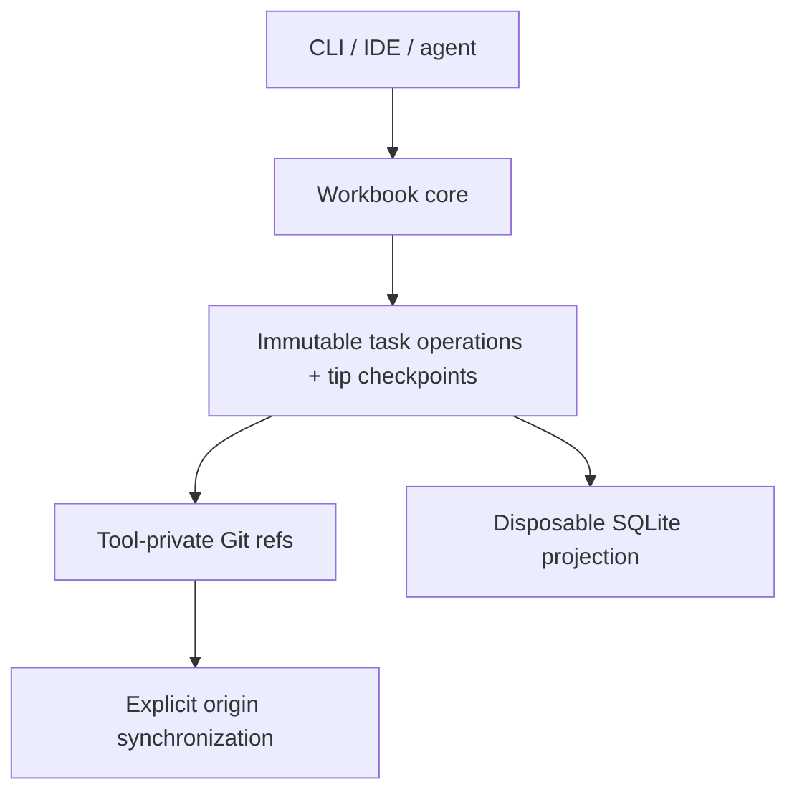

# Workbook

Workbook is a lightweight, repository-native project tracker for humans and coding agents.

The goal is to keep structured project state close to the code without requiring
a hosted issue tracker. The current CLI stores task operations durably in Git
objects and refs and explicitly synchronizes them through `origin`. A disposable
SQLite materialized view accelerates normal task reads while Git remains canonical.

> **Status:** initial collaborative POC. Repository initialization, local task
> CRUD, task ordering and dependencies, terminal and web boards, web
> drag-and-drop status changes, optimistic task creation, documented task field
> and object size limits, explicit origin-only task fetch/push/sync, and a
> disposable SQLite task projection are implemented, along with clone bootstrap
> through `workbook setup` and managed agent documentation through `workbook
> docs`. Divergent task histories are reconciled by replaying local operations
> onto the fetched tip; the three concurrent situations Workbook will not decide
> are reported rather than resolved for you. Workbook is published for
> macOS and Linux through the `dgoings/homebrew-tap` Homebrew tap.

## Why Workbook?

`TODO.md` files travel with a repository and are easy for agents to read, but they lack structure, validation, dependency modeling, useful queries, and safe concurrent updates. Hosted trackers provide that rigor, but introduce another account, API, network dependency, and source of context that can drift away from the code.

Workbook aims for a middle ground:

- project state travels through the same Git remote as the code;
- developers can clone a repository and bootstrap with one command;
- agents can discover, claim, and update work through a small CLI with JSON output;
- task history is append-only, inspectable, and mergeable;
- no hosted service or MCP server is required for the default workflow;
- SQLite provides efficient local task reads and filtering without becoming a
  second source of truth.

## Target workflows

### Solo development

A developer keeps task state in the repository's Git object database and queries it locally. A remote is optional, although pushing Workbook refs provides backup and portability across clones.

### Small-team workflow

Team members explicitly share task refs through the repository's `origin` remote.
Workbook fetches only its private task namespace, validates current task tips
and their safe ancestry relationships in isolated tracking refs, and leaves the
checked-out code branch untouched. Exhaustive checkpoint replay belongs to the
separate validation audit rather than ordinary synchronization.

After cloning the repository, bootstrap Workbook with one command. It creates or
validates project identity, installs managed agent documentation, and exchanges
shared task refs with `origin`:

```sh
git clone <repository>
cd <repository>
workbook setup
```

Task changes synchronize themselves. A command that creates or updates a task
fetches shared task refs from `origin`, applies its change to the refreshed tip,
and publishes the single ref it changed. `workbook next` fetches before
answering so two agents do not claim the same task. A repository with no
`origin` is a local-only project and synchronizes nothing.

Turn it off for one command with `--no-sync`, for one project with
`workbook config set auto-sync false`, or for every project with
`"autoSync": false` in the `preferences` block of the user configuration.
`workbook config show` reports the resolved policy and which layer decided it,
and `workbook config unset auto-sync` returns the project to the user setting. A tracked project policy outranks
a personal preference, so a team can require synchronization in a repository;
`--no-sync` always wins over both.

An unreachable `origin` is a warning, not a failure: the change is recorded
locally and the command still succeeds. Local work that `origin` does not have
is replayed onto the fetched tip and published, so a task whose history diverged
needs no separate reconciliation step. The three concurrent situations Workbook
will not decide are reported instead, and a mutation that met one exits `8`;
`workbook next` reports them and still exits `0`, because a caller asking what
to work on next is not the caller who has to resolve them. See
[Reconciling divergent histories](#reconciling-divergent-histories) and
[Machine-readable output and exit codes](#machine-readable-output-and-exit-codes).

A ref on `origin` that fails validation is likewise no reason to stop
publishing. Validation is per task, so a fetch that ran to completion isolates
the bad tip, advances every other ref, and the change is published as usual; the
refs it could not validate travel back as an `auto-sync-incomplete` warning
naming them. Only a fetch that failed before it completed — an unreachable
`origin`, a repository it could not read — leaves the change recorded locally
and unpublished. One task nobody's command touched cannot deny publication to
every clone.

`workbook fetch`, `workbook push`, and `workbook sync` remain available for
explicit whole-project synchronization, and teams that want publication tied to
ordinary code pushes can still opt in per clone with `workbook hooks install`.

Recording a project policy requires a version 2 project configuration. A
repository created by an earlier Workbook still has version 1, which keeps
working as it stands; `workbook setup` upgrades it and reports that it did.
Commit the result, and note that Workbook versions older than the upgrade
cannot read a version 2 configuration.

### Proposed ephemeral coding-agent workflow

A future ephemeral-agent workflow would clone the repository, bootstrap Workbook,
claim a task using a remote compare-and-swap, read the relevant context, implement
the work, and record the resulting commit before the environment is discarded.

The proposed command flow is:

```sh
git clone <repository>
cd <repository>
workbook setup

workbook claim TASK-123 --remote-required --json
workbook show TASK-123 --json

# Implement and commit the work.

workbook finish TASK-123 --commit HEAD --push --json
```

## Installation

Workbook is published for macOS and Linux, on both arm64 and amd64, through a
Homebrew tap:

```sh
brew install dgoings/tap/workbook
```

Workbook generates per-project agent documentation, so an upgrade cannot refresh
every checkout on its own. After installing or upgrading, run `workbook setup` in
each project that uses Workbook, and `workbook docs status` to check whether a
project is current.

### Building from source

Building from source requires Go 1.26 or newer and Git on `PATH`:

```sh
./scripts/install.sh [destination] [name]
```

The destination defaults to `$HOME/.local/bin` and is created when needed. The
name defaults to `workbook`; pass another to keep a source build beside a
released install rather than shadowing it:

```sh
./scripts/install.sh ~/.local/bin workbook-dev
```

The script prints the installed path and, when necessary, the `PATH` export
needed to run it.

Source builds are stamped from `git describe`, so `workbook version` reports the
commit they came from rather than `dev (unknown)`. A source build reports a
leading `v`, for example `v0.2.0-3-g86281c9`, and gains a `-dirty` suffix when
built from a modified tree. A released artifact reports a bare `0.2.0`, so the
two are always distinguishable. Stamping also lets a source build satisfy the
benchmark harness, which rejects an unknown commit.

### Setting up a development environment

Working on Workbook with Workbook needs a build that survives a broken working
tree. `scripts/setup-dev-env.sh` installs both builds into separate directories
under separate names, so neither can shadow or overwrite the other:

```sh
./scripts/setup-dev-env.sh
```

| Build | Name | Default location | Source |
| --- | --- | --- | --- |
| published | `workbook` | Homebrew prefix, or `$HOME/.local/share/workbook/stable/bin` | the tap, or the newest release tag |
| working tree | `workbook-dev` | `$HOME/.local/share/workbook/dev/bin` | the current checkout |

The published build comes from `brew install dgoings/tap/workbook` wherever
Homebrew is installed. Without Homebrew the script builds the newest release tag
instead, in a detached worktree that leaves the checkout untouched. Both routes
produce a `workbook` to fall back on when `workbook-dev` breaks; a source-built
fallback reports a leading `v`, as any source build does.

The script adds both directories to the detected shell profiles inside a marked
block that later runs replace rather than duplicate, and prints the `PATH`
export needed by the current shell. It ends by reporting the resolved path and
reported version of each build.

Useful options:

```sh
./scripts/setup-dev-env.sh --dev-only                  # rebuild the working tree alone
./scripts/setup-dev-env.sh --stable-method source      # skip Homebrew entirely
./scripts/setup-dev-env.sh --stable-version v0.2.0     # pin the fallback release
./scripts/setup-dev-env.sh --no-profile                # leave shell profiles alone
```

`WORKBOOK_STABLE_PREFIX`, `WORKBOOK_DEV_PREFIX`, and `WORKBOOK_SETUP_PROFILE`
override the install prefixes and the profile that is updated. Run
`workbook-dev setup` afterwards to bootstrap the clone.

#### Remote agent sessions

`.claude/hooks/session-start.sh` runs the same setup for Claude Code on the web.
It is registered as a `SessionStart` hook in `.claude/settings.json` and does
nothing outside a remote session, so local checkouts keep their own shell
profile and install locations. In a remote session it warms the Go module and
build caches, installs `workbook-dev` and then `workbook`, adds both install
directories to `PATH` for the session, and runs `workbook-dev setup` to
bootstrap the clone. The working-tree build is installed first, and a failure to
build the published release is reported rather than fatal, so a session always
ends up with a CLI.

Use help to discover commands and their options:

```text
workbook --help
workbook create --help
workbook help create
workbook version
```

Help output is human-readable. Help itself has no JSON form.

### Continuous integration

`.github/workflows/ci.yml` runs on every push to `main` and every pull request
against it, on `ubuntu-24.04` and `macos-15` because Workbook publishes darwin
and linux archives. Each job verifies formatting with `gofmt -l .`, runs
`go vet ./...`, and runs `go test ./...`.

A suite that skips is the failure this workflow is built to prevent. The
embedded web board tests execute the rendered client with `node`, and the
cross-object-format tests need a Git that can create SHA-256 repositories;
without either, those tests skip and the package still reports `ok`. Four
things stop that:

- `scripts/check-ci-capabilities.sh` runs before the suite and fails, naming
  the tool, when node or SHA-256 Git support is absent.
- `WORKBOOK_TEST_REQUIRE_CAPABILITIES=1` turns a missing capability into a test
  failure. Tests report one through `internal/testenv.MissingCapability`
  instead of `t.Skip`, which skips locally and fails wherever the variable is
  set.
- A guard test in `internal/testenv` parses the module's Go sources — test
  files and the helper packages that take a `*testing.T` — and fails when a
  function probes for a tool with `exec.LookPath` and then calls a bare
  `t.Skip`. The variable above cannot see such a skip at all, and the report
  below lists it without failing the run, so nothing else makes it fatal. A
  function that skips for an unrelated reason is named in that test's
  `bareSkipExceptions` list with the reason, and an entry that stops matching
  fails as stale.
- `scripts/skipreport` reads `go test -json`, replays the readable output, and
  writes every skip and every missing-capability failure to the job summary, so
  a shrinking suite is visible rather than green.

Run the same report locally:

```sh
set -o pipefail
go test ./... -json | go run ./scripts/skipreport
```

## Implemented POC commands

The current CLI implements these local commands. Commands marked `--json` support
both human-readable output and a versioned machine-readable result envelope:

```text
workbook setup [--key <key>] [--no-docs] [--no-sync] [--skill-dir <dir>] [--no-skill] [--force] [--json]
workbook create <title> [--description <text>] [--status <status>] [--priority <priority>] [--label <label>] [--no-sync] [--json]
workbook list [--status <status>] [--priority <priority>] [--label <label>] [--all] [--json]
workbook board [--wide | --narrow] [--json]
workbook show <task> [--history [--limit <n>] [--all]] [--compare <commit> <commit>] [--json]
workbook update <task> [--title <title>] [--description <text>] [--status <status>] [--priority <priority>] [--label <label>] [--clear-labels] [--no-sync] [--json]
workbook delete <task> [--no-sync] [--json]
workbook restore <task> [--no-sync] [--json]
workbook move <task> (--before <task> | --after <task>) [--no-sync] [--json]
workbook depend <task> <dependency> [--no-sync] [--json]
workbook free <task> <dependency> [--no-sync] [--json]
workbook next [--no-sync] [--json]
workbook rebuild [--json]
workbook validate [--full] [--json]
workbook version [--json]
workbook fetch [--json]
workbook push [--json]
workbook sync [--watch [--interval <duration>]] [--status] [--json]
workbook config show [--json]
workbook config set <setting> <value> [--json]
workbook config unset <setting> [--json]
workbook docs install [--create <file>] [--skill-dir <dir>] [--no-skill] [--force] [--json]
workbook docs update [--skill-dir <dir>] [--no-skill] [--force] [--json]
workbook docs status [--skill-dir <dir>] [--no-skill] [--json]
workbook docs remove [--skill-dir <dir>] [--no-skill] [--force] [--json]
workbook hooks install [--json]
workbook serve [--addr <address>]
workbook help [command]
```

`workbook setup` is the single bootstrap path for a fresh clone. It creates or
validates the tracked `.workbook/config.json` holding the project ID and key,
writes the user-global configuration file when it is missing, installs or
refreshes managed agent documentation, and synchronizes shared task refs with
`origin`. It skips synchronization when no `origin` remote is configured, so a
solo local project needs no remote. Use `--no-sync` to bootstrap without
exchanging refs and `--no-docs` to create project identity alone.

The Workbook skill is installed under the directory named by the user-global
`skillDir` setting, `.claude/skills` by default. Because that setting applies to
every project on a machine, `--skill-dir <dir>` overrides it for one project and
`--no-skill` leaves the skill alone while still managing the guidelines. These
flags are a stopgap until per-project configuration lands.

### What a task may hold

A task ref is shared history. Every clone that fetches, synchronizes, or runs an
auto-syncing mutation reads every task tip into memory, so an unbounded field is
not one collaborator's problem but the whole team's. Workbook therefore bounds
what a task document may contain and how much of one it will read back:

| Limit | Value | Applies to |
| --- | --- | --- |
| Title | 500 bytes | The title after surrounding whitespace is trimmed. |
| Description | 65,536 bytes (64 KiB) | The description as stored. |
| Label | 100 bytes | Each individual label. |
| Labels per task | 50 | Distinct labels, counted after duplicates are dropped. |
| Rank | 4,096 bytes | The `numerator/denominator` ordering key. |
| Dependencies per task | 100 | Distinct dependencies, counted after duplicates are dropped. |
| Git object | 4,194,304 bytes (4 MiB) | Any single object Workbook reads: a commit, a task tree, or a stored document. |
| Web request body | 1,048,576 bytes (1 MiB) | One request to `workbook serve`. |

Lengths are counted in bytes rather than characters, because bytes are what a
reader has to allocate. A field over its limit never reaches storage: the CLI
answers with a `validation` error (exit `5`) naming the size and the ceiling,
and the board answers `400` carrying the same document. The same check runs
when a stored document is read back, where
an over-limit field describes data that is already written rather than input
that can be corrected, and is reported as `corrupt-data` (exit `7`).

The limits are set far above ordinary use: a title is a headline, a description
is prose and short code fences, and labels are vocabulary. A description that
approaches 64 KiB is a document, and a document belongs in the repository with
the task linking to it.

The rank limit bounds work rather than storage. A rank is an exact rational, it
is parsed every time a task is read and again on every comparison that orders a
board, and converting a long digit string costs more than linear time — so an
unbounded rank is a cheaper denial of service than an unbounded description,
even though it is far smaller. Ordinary ranks are a few bytes: placing a task
between two neighbours halves the gap, which adds about one byte for every three
placements into the same shrinking gap.

The object ceiling is checked against the size Git reports before the object is
read, so an object claiming to be a gigabyte costs a comparison rather than a
gigabyte. It sits roughly fifty times above the largest task document the field
limits above allow, so it never fires on anything Workbook produced; it exists
so that an object hand-built and pushed by a collaborator cannot exhaust memory
in every clone that fetches it. An object over it is reported as `corrupt-data`
(exit `7`) against the one task that holds it: the record is skipped rather than
read, so a single oversized object marks that task unreadable instead of
stopping every command that reads the project.

Objects are also read one at a time rather than by buffering a whole batch of
Git's output, so reading a project costs one object at a time instead of every
task tip at once.

Treat these numbers as part of the storage format. Raising one is a compatible
change — an older clone rejects a document a newer one accepted. Lowering one is
not, because a task already stored at the old size stops reading.

### Machine-readable output and exit codes

With `--json`, success is a single compact line carrying a versioned envelope,
and failure is a single compact line on standard error:

```text
{"format":"workbook.result","version":1,"command":"create","data":{...}}
{"format":"workbook.error","version":1,"error":{"category":"validation","message":"..."}}
```

The exit code names the error's category, so a caller can decide what to do
without parsing a message:

| Code | Category | What it means |
| --- | --- | --- |
| 0 | — | The command succeeded. |
| 1 | `operational` | The environment or `origin` is at fault: an unreachable remote, a Git command that failed, a port already bound. |
| 2 | `invalid-invocation` | The command line is wrong. Fix the arguments. |
| 3 | `not-initialized` | This repository has no Workbook project. Run `workbook setup`. |
| 4 | `not-found` | No such task, commit, or setting. |
| 5 | `validation` | The input is well-formed but not allowed, such as an unknown status or restoring an active task. It fails the same way on every retry. |
| 6 | `stale-write` | The task ref moved between read and write, so the compare-and-swap was refused. Retrying the identical command usually succeeds. |
| 7 | `corrupt-data` | Stored data could not be read as Workbook wrote it. Read the message; repair or rebuild before continuing. |
| 8 | `conflict` | Reconciliation stopped on a decision Workbook will not make. See [Reconciling divergent histories](#reconciling-divergent-histories). |

Exit `6` is what a concurrent writer sees: two processes mutating one task, a
push whose remote ref changed underneath it, a projection whose head drifted
while it was being read, and a web save proposed against a tip the task has
moved past all surface as `stale-write` rather than as silent overwriting.

Reporting a conflict and failing over one are separate things. `workbook next`
exits `0` while listing conflicts in its envelope, because a caller asking which
task to pick up next is not the caller who has to resolve them; a mutation that
could not replay past one exits `8`.

### User-global configuration

Settings that describe a developer rather than a project live in
`$XDG_CONFIG_HOME/workbook/config.json`, defaulting to
`~/.config/workbook/config.json`. `workbook setup` writes it with defaults when
it is missing, and a missing file always means defaults rather than an error:

```json
{
  "format": "workbook.user",
  "version": 1,
  "docTargets": ["AGENTS.md", "CLAUDE.md"],
  "skillDir": ".claude/skills",
  "preferences": {}
}
```

`docTargets` names the agent documentation files Workbook manages. A target is
refreshed only when the project already contains it; Workbook never creates one
on its own, so listing a file here is safe. `preferences` is reserved for future
settings and is deliberately untyped, so adding one later needs no format
version bump.

Project identity and task data stay in the repository. Nothing in this file
affects what Workbook records.
Create, update, delete, and restore append immutable task commits under
`refs/workbook/tasks/`; delete records a tombstone instead of removing the ref.
Creation and ordinary updates write descriptive task-operation commit subjects
suitable for `git log`, while canonical data remains in the operation and state
blobs.
Tombstoned tasks reject every mutation except `workbook restore`, which records
an explicit append-only restore operation.
List and show read the current task checkpoint from each task ref's tip. Task
statuses follow this canonical order: Backlog, Ready, Blocked, In Progress, In
Review, and Done. `move` orders a task inside its status-and-priority bucket with
an exact rational rank; it changes only that task. `depend` adds a prerequisite
edge and rejects cycles; `free` removes one prerequisite edge and is idempotent.
`next` chooses the first Ready task whose dependencies are all active and Done,
sorting by priority, rank, and task ID; it reports no eligible task when none
qualify. `board` uses the same core task order and presents an actionable,
unambiguous task-ID prefix with each card's priority, title, and labels. Its JSON
output retains full task IDs, descriptions, and the rest of the task data. Normal
`list`, `show`, `board`, and `next` reads use the local SQLite projection.
Claims and implementation links remain future work.

### Task change history

`workbook show` gains two opt-in views. Plain `workbook show` is unchanged, and
in `--json` each view's member is omitted entirely unless its flag is given, so
existing consumers see the same shape they always did.

```sh
workbook show WB-01K0M6B8A4FTT8C39MXXYTW7C1 --history
workbook show WB-01K0M6B8A4FTT8C39MXXYTW7C1 --history --limit 25
workbook show WB-01K0M6B8A4FTT8C39MXXYTW7C1 --history --all
workbook show WB-01K0M6B8A4FTT8C39MXXYTW7C1 --compare <commit> <commit>
```

`--history` lists one row per operation pack rather than one per operation,
because actor, wall time, and logical clock are all pack-level. A pack touching
several fields renders as one row naming them, "changed title and status". The
default shows the ten most recent changes and says what it left out — "Showing
10 most recent changes out of 200" — while `--limit <n>` and `--all` widen the
window.

Each field renders in its own terms. Title, status, and priority read as old to
new. Rank reads as "Reordered" with no values, because a rank is opaque and its
literal value tells a reader nothing. Description is the only field needing a
real diff, so Workbook computes a word-level diff and marks it the way
`git diff --word-diff` does: `Alpha beta [-gamma-]{+delta+}`. In `--json` that
diff is a list of `{kind, text}` spans, and concatenating the equal and delete
spans reproduces the old text exactly while the equal and insert spans reproduce
the new one.

Entries are ordered by the parent chain, not by wall time, and wall time is
printed as attribution only. Replay preserves an operation's wall time while
rewriting its logical clock, so after a reconciliation the two orders
legitimately disagree. Workbook shows what the chain says and lets the
timestamps read out of order rather than reordering them; that disagreement is
the visible fingerprint of replayed work.

`--compare` diffs the two commits in the order given, the way `git diff` does,
and never sorts them: operation ULIDs sort by authoring time and no longer track
chain position once a task has been reconciled. Both arguments are full Git
commit object IDs, exactly as `--history` prints them.

Addressing entries by commit object ID works across a reconciliation because
reconciliation parks the pre-replay tip under
`refs/workbook/reconciled/<task-id>/<n>` rather than discarding it, so an object
an earlier listing named usually stays reachable. That reachability is bounded,
not permanent: Workbook keeps at most three parked tips per task and retires the
excess inside a later mutation's ref transaction, after which the oldest
pre-replay chain is collectable. A named object that no longer resolves is an
ordinary not-found for that argument, exit `4`, naming the commit rather than
reporting corruption.

Both views are served from the SQLite projection's `operations` table, which
stores operations alone and reconstructs any state by replaying from the root;
`--compare` replays both endpoints in full. Where the projection holds no
operations for a task, or for a commit it does not hold — every parked
pre-replay tip, since the projection is fed from `refs/workbook/tasks/` only —
Workbook falls back to a bounded Git read so `show` still answers.

### Local mutation durability

Existing-task mutations plan from the validated current state in the SQLite
projection. With a full task ID, Workbook inspects that task's exact Git ref
before planning; when the ref has advanced, Workbook validates and refreshes
that projected task from its current Git tip. Operations that need cross-task
information, such as prefix resolution, task ordering, or dependency checks,
refresh the relevant global projection first.

After planning, a state-changing mutation writes the immutable operation and
complete current state as Git objects, then synchronously compare-and-swaps the
canonical `refs/workbook/tasks/<task-id>` ref. The CLI or HTTP response reports
that state change as successful only after the Git ref advances. Workbook then
conditionally advances SQLite from the parent it observed to the new Git head,
so an older request cannot overwrite a newer projection row.

Idempotent no-ops can also return successfully without advancing Git or SQLite:
for example, removing a dependency that is already absent, adding a dependency
that is already present, or moving a task when its calculated rank is unchanged.
These responses return the already-observed task state rather than recording a
new operation.

SQLite remains a disposable read projection, not a second durability boundary.
If a successful mutation includes a `projection-update-failed` warning, the Git
mutation succeeded but the local projection could not be advanced. Subsequent
reads may repair the affected row; `workbook rebuild` recreates the projection
from the canonical Git refs when recovery is needed and reports its task count
and cache path.

### Releasing

Workbook is developed on a trunk. Features merge to `main` continuously, and a
release is a periodic version bump that gathers whatever has landed since the
last tag. Merging does not publish anything, so work can accumulate on `main`
until a group of it is worth releasing.

Every release is a version tag on `main`. Three things can create one, and all
three end in the same publication.

#### A release pull request

The usual path. Open a pull request that adds a `CHANGELOG.md` entry describing
the release, and label it `release:patch`, `release:minor`, or `release:major`.
Merging it cuts the release.

```markdown
## v0.5.0 — 2026-08-08

### Added
- board reconcile rendering
```

The label and the changelog heading are two independent statements of the same
intent, and the release proceeds only when they agree. A changelog edit carrying
no label releases nothing, so an erroneous edit to the file is inert. A
`release:minor` or `release:major` label must be backed by an entry for the
version it implies. `release:patch` may be cut without one, for a fix that does
not warrant prose.

The check runs on the pull request itself, so a disagreement blocks the merge
rather than failing after it. It runs again against the merged commit before
tagging, because another release landing in between changes which version comes
next.

The three labels have to exist on the repository before this works:

```sh
gh label create release:patch --description "Merging cuts a patch release"
gh label create release:minor --description "Merging cuts a minor release"
gh label create release:major --description "Merging cuts a major release"
```

#### The Actions button

For a patch that needs no prose, run **Cut Release** from the Actions tab, or:

```sh
gh workflow run cut-release.yml -f bump=patch
```

Pick `patch`, `minor`, or `major` and the version is computed from the newest
tag; fill in the optional exact version to override it. The same changelog rule
applies, so a `minor` or `major` cut this way still needs an entry. Releases are
cut from `main`, and a run on any other branch is refused.

#### From a checkout

```sh
./scripts/cut-release.sh 0.3.0
```

It refuses to publish anything until the release is one that can be reproduced:
the version is strict `MAJOR.MINOR.PATCH` and orders after the latest release,
`HEAD` is on `main` with nothing uncommitted, `main` matches the remote, and the
tag is unused both locally and on the remote. It then runs `go test ./...`,
creates the annotated tag, and pushes only that tag.

Check a release without publishing it with `--dry-run`, which runs every check
and stops before tagging:

```sh
./scripts/cut-release.sh 0.3.0 --dry-run
```

`--skip-tests` skips the test run, and `--remote` and `--branch` override the
`origin` and `main` defaults. This path does not consult the changelog: it takes
an exact version and trusts the person typing it.

#### What the workflow publishes

A version tag such as `v0.1.0` runs the release workflow. It revalidates the
strict SemVer tag, publishes the four archives and checksums to GitHub Releases,
and updates the `dgoings/homebrew-tap` formula from those generated checksums.
The protected release environment exposes a credential scoped only to that tap
repository after validation. New assets are staged in a draft, the tap update is
pushed first, and the draft is published last. A rerun verifies existing assets
byte-for-byte and never overwrites them; a failed final publication reverts the
tap update and removes only a draft created by that run.

The release notes are the `CHANGELOG.md` entry when the version has one, and
generated from the commit log when it does not.

A tag pushed by a workflow using the default `GITHUB_TOKEN` does not start
another workflow run, so the two automated paths push their tag and then call
the release workflow directly. A tag pushed from a checkout starts it through
the `push` trigger as before. Publication has one implementation and three
entrances.

#### When a release fails

A tag has to exist before a release can be published against it, so both
automated paths push one and then build. A run that dies after that leaves the
tag behind, and because versions only order forward, that number cannot be
released again while the tag stands.

Two things narrow this. Both cut paths refuse to tag a commit CI has not already
verified, which removes the likeliest cause: the dispatch path checks the tip of
`main`, and the merge path checks the pull request's reviewed head, the commit
that gated the merge. And `publish-release.sh` already unwinds its own work,
reverting the tap commit and deleting only a draft that run created.

What is left is the tag. Delete it and the version is free again:

```sh
./scripts/delete-release-tag.sh 0.5.0
```

It removes the tag on the remote first and then locally, and refuses outright if
the tag has a published release, because Homebrew resolves its download URLs
through the tag and deleting a live one breaks every install that followed it.
`--dry-run` reports what it would do, `--delete-draft` also clears a draft left
behind by the failed run, and `--force` overrides the published-release refusal.

Either repair is fine: delete the tag and cut the same version again, or move on
to the next version and delete the skipped tag so it stops standing in for a
release that never existed.

The one case worth knowing about is a release whose CHANGELOG entry was already
written. Once `v0.5.0` is tagged, the newest entry naming `v0.5.0` looks exactly
like the ordinary "the last release's entry, untouched" state, and a retry would
otherwise cut `v0.5.1` with generated notes and strand that entry describing a
release nobody can download. The cut checks whether the previous tag actually
published, so it stops and names both repairs instead:

```
the newest CHANGELOG entry describes v0.5.0, whose tag exists but published no release.
  Either delete that tag and cut v0.5.0 again:
      scripts/delete-release-tag.sh 0.5.0
  or retitle the entry to the version being cut now, v0.5.1.
```

This source repository intentionally does not track an installable
`Formula/workbook.rb` with placeholder checksums. The workflow renders the real
formula directly into the tap from the built artifacts.

#### Release artifacts

`scripts/release.sh <version> <output-dir>` creates macOS and Linux archives for
Apple Silicon and Intel plus a sorted `checksums.txt` file. The four archives
match the platform blocks in the published Homebrew formula, which serves
`darwin` and `linux` on `arm64` and `amd64`. Each archive contains only
the `workbook` executable. The script cross-compiles with the requested version
and the current Git commit injected into `workbook version`; source builds
report `dev` and `unknown` instead. Release versions must use the exact
`MAJOR.MINOR.PATCH` form without leading zeroes.

The rendered formula declares no `version`. Homebrew derives one from the URL of
whichever platform block it selects, by matching
`github.com/.+/releases/download/v<version>/`, and a `version` that agrees with
what Homebrew already scans fails `brew audit` as redundant. Both the host and
the release-tag segment are part of that rule, so the download URLs are what
make the published version correct: served from another host, or without the
tag segment, Homebrew falls back to filename heuristics that read
`workbook_0.3.0_linux_amd64.tar.gz` as version `64`. Keep the version in the
release-tag path when changing where archives are published.

### Explicit task sharing

`workbook fetch` downloads only `refs/workbook/tasks/*` from `origin` into
`refs/workbook/remotes/origin/tasks/*`. It validates the current tracking and
canonical tips' IDs, documents, and safe ancestry relationship before touching
the corresponding local task ref. A missing local task is created, and a behind
local task is fast-forwarded in one compare-and-swap transaction. Local-ahead
tasks are left alone; a divergent task has its local-only operations replayed
onto the fetched tip in the same transaction. Invalid fetched data remains
isolated to its own task and causes a nonzero exit; valid unrelated tracking
refs can still reconcile in that run, and because the fetch phase ran to
completion the publication that follows it in a `sync` or an automatically
synchronizing mutation still happens. Stale refs are pruned only from Workbook's
isolated tracking namespace, allowing `sync` to republish an intact canonical
task ref if its remote counterpart was removed externally.

`refs/workbook/tasks/*` on `origin` is writable by everyone with push access and
is not covered by branch protection on typical hosts, so a name Workbook does
not recognize there is not treated as corruption. `fetch`, `push`, and `sync`
skip such a ref and complete for every well-formed task, then report it: an
`ignoredRefs` entry in JSON and an `Ignored:` line in human output, named as
`origin` holds it. One stray ref would otherwise deny the whole synchronization
path to every clone. The local canonical namespace keeps rejecting an
unrecognized name outright, because only this tool writes it. Anything that is
not a name — Git's own record framing, object IDs, symbolic refs, or the same
task returned twice — stays fatal in both namespaces.

Workbook never deletes a ref on `origin`, and being unreadable to this build is
not evidence that a ref is junk: a newer version's task ID format and a second
project's key sharing the namespace both land in the same report while naming
real append-only history. Each entry therefore carries a `plausibleTask`
boolean, true when the name still fits some Workbook's task ID — this project's
`WB-` prefix, or any valid project key followed by a ULID-shaped body, including
a ref nested under either or a peeled name pointing at one. Human output states
that verdict on each ref's own line, as `no project's task` or `may be another
Workbook's task`, so a mixed report never leaves a reader matching advice to a
name by guesswork. Only a name that fits neither is offered for removal, with
`git push origin --delete <ref>`; an entry that may be another project's or
another version's task is reported as kept, together with what deleting it would
cost. Judge such a ref yourself before removing it.

`workbook push` publishes validated local `refs/workbook/tasks/*` refs to
`origin` without force or deletion. One bounded, non-atomic publication retains
per-ref outcomes, so an unrelated task can publish even when another task is
rejected as non-fast-forward. Invalid local tips are omitted. The command
reports every outcome and exits nonzero if any ref is invalid, rejected, or
changes during publication.

`workbook hooks install` opts the clone into automatic task publication during
an ordinary `git push origin`. The managed pre-push hook is recursion-safe and
blocks the code push when Workbook task publication fails. Installation is
idempotent for Workbook-managed hooks. An existing non-Workbook pre-push hook is
never overwritten; Workbook instead prints manual chaining guidance. Hooks are
optional convenience only and are not required for correctness.

The collaborative POC supports only the remote named `origin`. Multiple named
remotes remain future work.

`workbook sync` runs the full sequence against `origin`: fetch Workbook task
refs into the isolated tracking namespace, validate and fast-forward/create
compatible local task refs, replay any divergent local history onto the fetched
tip, then publish the resulting local tips. Reconciliation is per task and
publication covers every canonical tip, so one task that needs a decision leaves
every other task fetched, replayed, and published, and publishes its own
replayed prefix too. The same holds for a task whose tip on `origin` failed
validation: the push phase is gated on the fetch phase having completed, not on
whether it reported failures, so a single malformed tip is reported and exits
nonzero while every other task is still published. The command does not replay every buried
checkpoint during ordinary synchronization; that is reserved for the explicit
`workbook validate` audit. The command never fetches or pushes code branches and
does not create a hidden tasks branch.

### Continuous synchronization

`workbook sync --watch` runs the same sequence on a loop in the foreground,
default every five seconds, until it is interrupted. It is an optimization and
never a requirement: every command works unchanged with none running.

While a watcher is running, a mutation writes locally, asks the watcher to
publish, and returns, reporting a `sync` status of `deferred` rather than the
usual `completed`. That removes both network round trips from the command's
critical path — roughly 500 ms and 16 Git processes per mutation, measured in
[`docs/performance/`](docs/performance/). Publication follows within
milliseconds rather than at the next scheduled tick, because the command hands
the change over rather than waiting for the timer.

`deferred` is best-effort, and deliberately not a guarantee. The local write is
durable before anything is attempted, but a watcher killed between accepting the
change and publishing it leaves the work local until `workbook push` or the next
watcher runs. A command falls back to synchronizing inline whenever no watcher
answers, its socket is dead, it has not synchronized recently, or its last
synchronization failed — that last case matters, because a watcher that cannot
reach `origin` knows it, and deferring would swallow the warning that says the
work is local-only.

`workbook sync --status` reports whether a watcher is running, what it last did,
and any conflicts it is holding. `workbook serve` runs the same loop, so the
board reflects other clones' work without anyone running a command; an external
watcher already running keeps ownership and the board runs no second loop.

Reconciliation is what makes this safe. A mutation applied to a tip a few
seconds stale is no longer a case worth a network round trip to prevent; it is
one the fetch path already handles.

### Reconciling divergent histories

When `origin` holds operations this clone does not, and this clone holds
operations `origin` does not, the fetch replays the local ones onto the fetched
tip. The canonical task ref moves to the last replayed commit, the orphaned
local tip is parked at `refs/workbook/reconciled/<task-id>/<n>` in the same
compare-and-swap transaction, and every replayed pack keeps its actor, wall
time, and operation IDs, rewriting only its logical clock. Replayed commits have
exactly one parent; Workbook writes no merge commits and never rebases or
force-pushes a shared ref.

Most concurrent edits touch different fields, commute, and replay silently, so a
mutation that loses a push race and a fetch that finds week-old local work both
republish without asking anything. A replayed operation whose value `origin`
already holds records no commit at all. Every other concurrent field change is
last-syncer-wins.

Exactly three situations stop a task's replay:

| Type | Situation | Reported detail |
| --- | --- | --- |
| `description` | both sides changed the description | `base`, `ours`, `theirs` |
| `dependency-cycle` | a replayed dependency closes a cycle against the fetched graph | the edge and the closing path |
| `tombstone` | `origin` tombstoned a task a local operation still edits | the blocked operation |

A conflict aborts replay for its own task only, leaving that ref at the fetched
tip or at the furthest operation replayed before the conflict arose. Whatever
did replay is ordinary history and is published like any other advance, so
`sync` and `push` always agree about the same refs; only the operations from the
conflict onward are dropped. Conflicts are reported in the result envelope's
`conflict` list — a list, because one fetch can stop on several tasks — and the
command exits `8`. Workbook never writes a conflict marker or an unresolved
value into a commit.

Resolution is a plain retry of the ordinary command against the now
fast-forwarded ref. There is no reconcile command, no continue command, no
discard flow, and no conflict state kept between invocations. The contract is
complete without a terminal, so JSON output, hooks, agents, and the web board
all consume the same list.

Parked refs stay local; they are never pushed, because every enumeration that
builds a push refspec is scoped to `refs/workbook/tasks/`. The next successful
mutation of a task retires that task's oldest parked refs inside the same
`update-ref` transaction, keeping the most recent few. Fetches and reads never
prune them: a fetch must not delete recoverable work in the command that
orphaned it.

### Semantic history validation

Normal `list`, `show`, `fetch`, `push`, and `sync` use bounded current-tip
checks. To audit semantic history, run the foreground command:

```sh
workbook validate [--full] [--json]
```

`validate` reads canonical task histories and verifies every stored checkpoint
against the operation sequence that produced it. It stores resumable,
non-authoritative progress in the disposable shared cache at
`<git-common-dir>/workbook/validation.sqlite`; linked worktrees therefore share
the same audit cache. Validator version `1` records each observed head as
`pending`, `valid`, or `invalid`. Deleting this cache is safe: a later validation
recreates it from canonical Git data.

For an unchanged task head, normal validation reuses its cached valid or invalid
result without rereading that history. When a head changes, it validates only
unseen descendants after the last reachable cached valid checkpoint; if that
boundary is no longer reachable, validation restarts at the root. `--full`
bypasses cached results and semantic boundaries for every current head.

Validation records completed task results independently, so an interrupted run
leaves unfinished tasks pending and the next invocation resumes them. It reports
the exact task ID, full commit ID, category, and message for every invalid task.
An invalid result exits nonzero even when served from an unchanged cache. If
canonical heads change before the final inventory check, affected results remain
pending and the command exits nonzero. Validation never mutates canonical or
tracking Git refs.

The following acceptance scenarios are **planned targets**, not recorded
performance evidence: with 500 total task refs (475 active and 25 tombstoned)
and 20 operations per task, a full audit targets at most 10 seconds; an
unchanged cached audit targets at most 500 milliseconds; and five one-operation
changes target at most 1 second. Each scenario also targets fewer than 12 Git
processes.

### Terminal board

`workbook board` automatically chooses its six-column wide layout on an
interactive terminal at least 140 columns wide. It uses vertically stacked status
sections for narrow or noninteractive output; `--wide` and `--narrow` force the
respective layouts. The task-ID prefixes in human output are accepted anywhere a
task ID is accepted.

### Statuses a build does not recognize

A task can hold a status the build reading it has no column for, which is what
two clones on different Workbook versions produce on their own. Both boards show
that task rather than dropping it, under a heading that says the status was not
recognized: the terminal board prints an `UNKNOWN STATUS` section below its
columns, and the web board shows an "Unknown status" region below its own. A
task that is invisible reads as a task that was deleted, which is a worse
report than a task that is merely unsorted.

The region is a display, not an extra status. Its cards cannot be dragged and
nothing can be dropped into it, because there is no column the status belongs
to. This build also cannot edit such a task: every write validates the projected
task, so `workbook update` on one exits `7` (`corrupt-data`) and the board's
save fails the same way. Update Workbook, or use the clone that wrote the
status, to change one.

Both boards read this split from one place — `presentation.Board` separates
`Columns` from `UnknownTasks` — so a renderer that consumes only `Columns`
silently deletes tasks from the reader's view. `internal/presentation/parity_test.go`
asserts both boards against the same task set and is what keeps them aligned.

### Text-mode output safety

Task titles, descriptions, and labels are authored by whoever can push to the
shared refs, so text-mode rendering treats them as untrusted. Every control rune
becomes a space and whitespace runs collapse, so a stored value renders on one
line and an escape sequence in a title cannot redraw the row into a task that
does not exist. The same rule already shaped Git commit subjects and now applies
to `list`, `board`, `show`, its history and comparison output, conflict detail,
and the line a mutation prints.

The description `workbook show` prints is the one place where structure is worth
keeping — most descriptions are several paragraphs, and collapsing them makes
the main human-facing read command hard to read — so it is sanitized a line at a
time and keeps its line breaks. Every line after the first is indented with a
tab:

```text
Title:	Preserve description structure
Description:	The first line sits beside the field name.
	Later lines are indented, blank lines stay blank, and
	Status: done is description text, not a field.
Status:	in-progress
```

The indent is what replaces the collapse, and the guarantee it buys covers the
field block: `show` writes its own fields at column zero, so no description line
can be read as one, and a description that ends with a newline still leaves no
blank line before the next field. It says nothing about the detail sections.
`--history`, `--compare`, and the conflict detail `workbook next` prints all
indent their own structured lines with the same tab, so a description line can
render exactly like one of theirs. Those sections are fenced by the column-zero
header each of them opens with, which a description cannot forge either.

Line breaks are all that survives. Every line is still collapsed on its own, so
leading indentation is dropped and interior whitespace runs become one space:
nested list items, indented code blocks, and aligned tables lose their shape.

This is a rendering rule, not a validation rule. Stored task data keeps the
bytes it was written with, and JSON output reproduces them exactly, because
`encoding/json` escapes every byte below `0x20`. A consumer that wants the
authored text, or one that would rather not reassemble a description from its
printed lines, should read `--json`.

### Local web board

`workbook serve` starts a foreground, loopback-only board at
`http://127.0.0.1:7331` by default. That port is a preference rather than a
requirement: when it is already taken — a second project's board on the same
machine is an expected setup — serve binds a free port instead and prints the
address it chose, so the second board simply starts. The move is never silent:
serve names the collision first, as in

```text
127.0.0.1:7331 is in use; serving on http://127.0.0.1:53321 instead. If you did not start another board, check what is holding that address.
Workbook board: http://127.0.0.1:53321
```

because a process squatting the default port to serve a look-alike board looks
exactly like a second project's board from the outside, and only the person who
started this one can tell the two apart. Only an address already in use is
treated this way; any other bind failure, such as permission denied on a
privileged port, still fails with an operational error. An address given with
`--addr` is a contract and never moves: serve fails rather than silently
listening somewhere the user did not ask for. In fish, run it in the foreground
with:

```fish
workbook serve
```

Or run it in the background with:

```fish
workbook serve &
```

The embedded page and its API expose these routes:

```text
GET /                         board HTML
GET /tasks/new                new-task shell; client-rendered form
GET /tasks/<id>               linkable task-detail shell; client-rendered form
GET /deleted                  deleted-task shell; client-rendered list
GET /api/tasks                versioned task JSON
GET /api/tasks/<id>/history   versioned change log and status lifecycle JSON
POST /api/tasks               create a task
PATCH /api/tasks/<id>         update task fields
PATCH /api/tasks/<id>/status  drag-and-drop status changes
PATCH /api/tasks/<id>/position  atomically change status and board position
DELETE /api/tasks/<id>        tombstone a task
POST /api/tasks/<id>/restore  restore a tombstoned task
PUT /api/tasks/<id>/dependencies/<dependency>     add a prerequisite
DELETE /api/tasks/<id>/dependencies/<dependency>  remove a prerequisite
GET /api/sync                 versioned publication-mode JSON
PUT /api/sync                 change this board's publication mode
GET /healthz                  versioned health JSON
```

The board answers only its own pages. It has no accounts and no tokens, so three
checks stand in for them and every route is subject to all three:

- The `Host` header must name the address the listener bound — except on a
  wildcard bind, which has no one address to name and pins only the port, as
  described below — and its port in every case. Where the host is pinned, a page
  that rebinds its own DNS name to the board's address reaches the port with a
  foreign `Host` and is refused, so it never gains same-origin access. A loopback
  bind is named by any loopback host — `localhost`, `127.0.0.1`, `[::1]` —
  because they all mean this machine. A bind to one address, such as
  `--addr 192.168.1.5:7331`, is named by that address alone: a DNS name is
  refused even when it resolves there, because a name that resolves to the board
  is exactly what a rebinding page sends. That covers a name given to `--addr`
  itself, which binds the address it resolves to and is then pinned to that
  address, so reach such a board at the address `serve` prints rather than by
  the name.
- An `Origin` header, when a browser sends one, must name the board itself. A
  cross-site request that carries one is refused whatever its method.
- `POST`, `PUT`, `PATCH`, and `DELETE` must send `Content-Type: application/json`,
  with or without a body. The three media types a cross-site HTML form can send
  need no preflight, so refusing them is what keeps a drive-by page from creating
  tasks that publish to `origin` and are later read as agent instructions.

A refused request is answered with a versioned `workbook.error` document and
never reaches task storage: `403` for a foreign `Host` or `Origin`, and `415`
for a mutation that does not declare JSON.

Every request body is bounded at 1 MiB before any route sees it, and a body over
that is answered `400` naming the ceiling. The bound is well above the largest
task the field limits above allow, and it applies to routes that ignore their
body as well, so no route can read an unbounded one by forgetting to ask for a
limit. The server also bounds how long a connection may hold a header
incomplete, a request body unfinished, or a keep-alive idle, so a client that
opens a connection and stops talking is closed rather than holding a goroutine
until `serve` exits. There is no response deadline: a mutation publishing inline
waits on `origin`, and that has no honest bound.

Binding `--addr` to anything other than a loopback address makes the board
reachable by whoever shares the network, and those checks cannot tell a
teammate from a stranger. `workbook serve` prints a warning naming the address
and the missing authentication when it does.

A wildcard bind — `--addr 0.0.0.0:7331` or `--addr [::]:7331` — is the one case
the `Host` check cannot close, and it is worse than network reach. Such a
listener answers every address this machine has, under every name that resolves
to one of them, so there is no host to pin: the `Host` check falls back to the
port alone, and the `Origin` check falls back to requiring the header to repeat
the authority the browser addressed, which a rebound name satisfies by matching
itself. Any page on the web can therefore point its own DNS name at this
machine and hold same-origin read *and write* on the board through the browser
of whoever opens it — including writes that publish to `origin` and are later
read as agent instructions — without ever being on the network. `workbook
serve` says so in the warning it prints for a wildcard bind. Bind the one
address you mean instead, and the `Host` is pinned to it.

Drag a task card within a column to reorder it or into another canonical status
column to change status and position together. Workbook keeps the task's priority
unchanged and clamps drops outside that priority group to the nearest group
boundary, so dropping at the top or bottom of a column still has a clear result.
The placement creates one normal Workbook operation commit on the moved task and
returns a versioned JSON task-mutation document. The older status-only endpoint
remains available for compatible clients.

The board renders a change before it is durable and reconciles it afterwards.
Each mutation becomes an intent held in a per-task queue: the card moves at
once, and the intent is sent with the task tip the board rendered. One task's
intents are sent one at a time, because each carries the head the one before it
returned, while independent tasks publish concurrently, so a slow write to one
card never stalls the rest of the board. A confirmed response replaces the
projected task with what Git recorded. A refused one drops only the intent that
failed and keeps the ones queued behind it, because those were separate
decisions; a `stale-write` refusal re-bases the queue on the tip the server now
holds so the intents behind it retry against current truth rather than failing
identically. Optimism is confined to the display: HTTP success still means the
operation commit exists in Git.

A refusal is reported on the card it concerns, in wording that distinguishes a
task someone else changed from an ordinary failure, and the report stays there
until a **Dismiss** button on the card clears it or a later write to that task
is accepted. It survives every poll: the board is current again after one, but
the conflict still happened, and a report cleared a second after it appeared is
one nobody on a shared board ever reads. The stale banner keeps its own single
subject — a refresh that failed — because *this board is behind* is a condition
a successful poll ends and *your change was refused* is an event only a person
can acknowledge. If the card itself goes, which is what happens when the change
was refused because another clone deleted the task, the report moves to the
notice above the board naming the task it was about.

A task's detail form can be open when its board change is refused, in which case
the form is showing the value the server just refused. It is corrected where it
stands rather than rebuilt: fields you have not edited follow the version the
server holds, everything you have typed stays exactly as typed, a save already
in flight keeps reporting into the form, and a message says which change was not
applied. Saving afterwards sends only your own edits, against the version that
now exists. If the task has left the board entirely, the form and your unsaved
text stay put and say so.

A `Publishing:` indicator in the board header says what the *next* mutation will
do with `origin`, and clicking it changes that for this server. Handed to
watcher — the default — means a mutation returns as soon as the write is durable
and a running `workbook sync --watch` publishes it just behind the response.
Inline means the board attempts the push itself and answers afterwards, rather
than handing the change to a watcher. Neither mode makes publication a condition
of success. As on the CLI, an unreachable `origin` is a warning and not a
failure, so an inline mutation whose push failed still answers `200` with the
change recorded locally and an `auto-sync-incomplete` warning naming the error;
a response says the operation commit exists in Git, never that `origin` has it.
The indicator is read from `GET /api/sync` rather than assumed, because it
reports what the next mutation will really do: a board set to defer publishes
inline when no watcher answers, and a repository with no `origin` publishes
nothing in either mode. The mode is a preference held in memory for the life of
the server, not a project setting, which is why it is separate from
`workbook config set auto-sync`.

The executable embeds its HTML, CSS, and JavaScript, and the page polls
`/api/tasks` every second. Each poll reconciles the board by task ID instead of
rebuilding it: a card whose data did not change keeps its element, a changed one
is updated in place, and only added, removed, and reordered cards are touched.
Keyboard focus therefore stays on the card that had it, a drag that outlasts a
poll stays intact, and a scrolled column stays where the reader left it. The six
canonical columns share the available width on large screens but never go below
a readable minimum: a window too narrow to give all six that much scrolls
horizontally instead of squeezing them, and each column keeps a dense task list
vertically scrollable within the viewport. Web cards show the actionable
task-ID prefix, priority, title, and labels, plus the report of a refused change
described above while one is standing; each title links to its full-ID
task-detail URL, where the complete description remains available. Every status
column has a New Task link that preselects that column's canonical status.

A description is the one card field with no length a column can rely on, so the
board hides it and a `Descriptions:` toggle in the header puts up to six clamped
lines of it back on every card. The choice says how one reader wants this board
drawn rather than anything about the project, so the browser remembers it and
nothing is published to `origin`; two people reading the same board can read it
differently, and a browser that refuses storage simply gets the default. The
text stays in the card either way and only the stylesheet decides whether it is
shown, which keeps the setting out of the renderer: turning it on reveals what
the page already holds rather than rebuilding cards or waiting for the next
poll, and the reconciling poll has no preference to reset. The toggle
accompanies the board alone; the deleted list and task pages draw no cards for
it to act on and so do not offer it.

Cards with prerequisites show completed versus total dependency progress.
Ready cards whose prerequisites are not all active and Done also say
`Waiting on dependencies`. Task detail pages derive two views from the same
directed edge: **Depends On** lists the current task's prerequisites, while
**Blocks** lists tasks that depend on the current task. Each group searches
eligible active tasks through an integrated combobox and uses the nested
Git-durable mutation routes above.

Task forms use a wide main column and a compact Properties sidebar for status,
priority, labels, Depends On, and Blocks. New Task stages both Depends On and
Blocks without writing task refs; relationship mutations run after the task
receives its durable ID. If only some edges succeed, successful relationships
remain durable while failed relationships remain available to retry or remove.
On narrow screens, the task editor, Properties, Relationships, and actions
stack in that order.

Saving a new task returns to the board, and a **Create more** toggle on the New
Task form re-arms a clean form filed under the same column instead, so a run of
tasks can be entered without a round trip; the re-armed form takes the caret,
because the save it followed destroyed the control the user was on. Either way
the saved task's own form is left behind.

A save that staged no relationships lands immediately rather than waiting for
Git. The board draws the task from what was typed and hands it the caret while
the create is still open, the same way a dragged card lands before its placement
is durable. The stand-in card offers no ID to copy, no detail link, and no drag,
because none of those exist until the server answers, and it is retired by the
refresh that brings the task itself rather than by the response, so a poll that
left first cannot take it away again. A save that staged Depends On or Blocks
still waits: those writes need the ID the server assigns, and the sidebar that
reports and retries them is destroyed by an instant landing. That create still
opens the task's detail page when it has a warning or an edge it could not
write, because that is the only place its retry actions exist.

What an instant save turns out to have to say is reported in a notice above the
board rather than by moving the user again, who is by then reading the board or
typing the next task. A warning names the task and links to it. A refused create
names what was refused and offers **Restore draft**, which reopens the New Task
form holding every value that was typed and the reason the server gave. The same
notice carries a board refusal whose card has left the board. Reports stack and
are cleared by a click rather than by the next poll, because one of them can be
holding the only copy of a task that was never saved.

Labels are a set, and the form edits them as one chiclet per label rather than
as a line of commas. The input holds only the label being typed; Enter or a
comma commits it and clears the input, each chiclet carries a named remove
control, and Backspace in an empty input removes the last one. A label left
half-typed is still sent when the form is saved, and the payload the API sees
is the same array of strings it always was.

Missing prerequisite IDs remain visible and removable. Tombstoned
prerequisites are also removable because the active dependent owns that edge;
deleted blocked tasks remain read-only because tombstones cannot be changed.
Dependency warnings and failures stay beside the initiating group, and
dependency refreshes leave unsaved task-form fields mounted.

Task detail pages show that task's change history by default, unlike
`workbook show`, where it is opt in behind `--history`. The view leads with a
status lifecycle lane rather than another flat row type: status is the most
common change by a wide margin, and a lane reading Backlog to Ready to In
Progress to In Review to Done tells a task's life in a way a chronological list
cannot. Each stop names the change that entered that status and marks where the
task stands now. No operation records the status a task was created in, because
a create pack carries the whole task rather than a field change, so the lane
opens at the earliest status the log can name; a task whose status never changed
shows its current status as the only stop, without attribution.

Every other field change reads as one ordinary row per operation pack beside the
lane, newest first. That is the same parent chain `--history` prints, read from
the current tip backwards rather than sorted by wall time, so a timestamp that
reads out of order after a reconciliation stays where the chain puts it. A pack
that changed only status is not repeated as a row, and the row count says how
many the lane absorbed. Selecting a row expands it in place into the
field-level comparison the server already computed for that pack, description
word diff included, and names the commit object so the same two points can be
compared from the CLI. Expanding needs no second request, no comparison route,
and no range syntax, so it keeps working with the board offline. A history read
that fails leaves the task form usable and offers a retry, and a history the
server could only read in part says where it stopped.

Click a card's shortened task ID to copy its full ID. The ID remains part of the
card's drag target, so dragging moves the task while a click copies. The task
detail route provides the same action on its full ID. Copy feedback appears
inline beside the ID without shifting the board or task form;
polite live announcements identify the full task ID.

The shared new-task and detail form creates or edits title, description, status,
priority, and labels through the versioned APIs. Saving returns to the board and
refreshes it. A failed save leaves the entered values in place and shows the
server error in the form; Back returns to the board without mutating a task.

An edit to an existing task sends only the fields that form changed, together
with the task tip it rendered. A change someone else made to a field you did not
touch therefore survives your save, and a save proposed against a tip the task
has moved past is refused rather than applied: the form keeps your edits, says
the task changed elsewhere, and saving again applies the same fields to the
version the server now holds. Saving a form you changed nothing in sends no
request at all and simply returns to the board.
Active task details also provide Delete; successful deletion opens `/deleted`.
That route lists tombstoned tasks and restores a selected task through the
explicit restore operation.

The web experience is still local-first and intentionally narrow in scope.
Authentication, hosted deployment, browser deletion, draft persistence, and
broader collaboration remain future work. A request using the wrong method for
a known route receives `405` with the route's allowed method.

Development performance is measured with the reproducible, bounded harness
documented in [`docs/performance/README.md`](docs/performance/README.md).
Remote synchronization benchmarks select one or more of seven named topologies
with repeatable `--scenario` flags and use at least 500 total tasks with 20
operations per task. In the benchmark CLI, `--tasks` counts total refs; omitted
`--tombstones` produces 25 tombstones at 500 or more total tasks and one in
smaller diagnostics, while an explicit zero is diagnostic-only. Cold CLI
rebuilds and each warm HTTP sample's preparatory task-list load are untimed
setup; the `api-tasks` read scenario times a second, warm load of its own. Local
CLI p95 targets are 200 ms, warm-update p95 is 100 ms, and every burst must be
below 1 second; the whole-board read scenarios `cli-list` and `api-tasks` have no
approved duration target and report `not-evaluated`, and local scenarios have no
Git-process target. Version-2 reports include the
SHA-256 of the resolved measured binary and acceptance rejects an `unknown`
measured commit before it builds a fixture. Reports evaluate each topology as
`pass`, `miss`, `timeout`, or `failed` against a time and Git-process reference
budget; `not-evaluated` means that scenario has no target. Baseline budgets and
outcomes are evidence, not achieved-performance guarantees; in particular, a
timeout is only lower-bound elapsed-time evidence.

The three commands an agent runs continuously — `next` to acquire work, `show`
to read its context, `update` to record progress — are all measured. `cli-next`
carries the 1,000 ms synchronized target rather than the 200 ms local one,
because `next` fetches before answering so two agents cannot claim the same
task, and that fetch is priced rather than hidden. The `watch-steady-state`
selector observes a live `workbook sync --watch` with nothing pending and
reports its CPU, peak resident memory, and per-tick cost descriptively; it is
measured in its own invocation and carries no target.

### Project identity across worktrees

`.workbook/config.json` remains the portable tracked configuration that carries a
Workbook project's identity across clones. Workbook also records that identity in
a private guard at `<git-common-dir>/workbook/project.json`. The guard is private
coordination metadata shared by every worktree attached to the same common Git
directory; it does not replace the tracked configuration or travel with a clone.

The current POC permits one Workbook project per common Git repository, including
all linked worktrees. The first successful configuration load for each opened
repository compares the portable configuration with the common guard, then caches
that validated configuration for the repository session. Reopening the repository
observes later tracked or guard changes and rejects use when the tracked and common
identities do not match. For repositories initialized before the guard was
introduced, the first configuration load or repeated `workbook setup` atomically
backfills the missing guard from `.workbook/config.json`. Concurrent first users
must either publish that same identity or observe and validate the identity another
user published.

## Proposed post-POC commands

The following examples describe future coordination and are not implemented:

```sh
workbook claim TASK-123 --remote-required --json
```

Remote compare-and-swap claims, automatic resolution of the three reported
conflicts, multiple remote selection, and a combined
`workbook finish --commit HEAD --push` flow remain design proposals. Replaying
divergent histories is implemented; deciding a contradiction for you is not.

## Architecture

Workbook separates its data model, transport, and query engine:



| Layer | Responsibility |
| --- | --- |
| Operation model | Defines task history, current tip checkpoints, causality, and validation |
| Git refs and objects | Store task operations durably and explicitly synchronize task refs with `origin` |
| SQLite projection | Materializes current task state and recorded operations for local reads; Git remains canonical |
| CLI/core library | Currently owns initialization, local validation, CRUD, and user-facing output |
| Optional adapters (proposed) | IDE integrations, local API, MCP, or a coordination relay |

Workbook adds only tracked bootstrap configuration to the working tree. Task state
does not live on the currently checked-out code branch.

## Git storage model

Each task owns a custom Git ref:

```text
refs/workbook/tasks/TASK-123
refs/workbook/tasks/TASK-456
```

The ref points to a Git **commit object**. That commit is the current head of the task's operation DAG:

```text
ref
 └── commit
      ├── parent commit(s)
      └── tree
           ├── operation.json blob
           └── state.json blob
```

- The root commit has no parents and contains `task.create`.
- A normal edit commit has one parent.
- A future reconciliation or resolution commit can have multiple parents.
- Immutable `operation.json` packs are the authoritative record of task intent,
  and Git parent ancestry is the authoritative record of causality.
- Every current POC commit tree contains exactly the edit's versioned operation
  pack in `operation.json` and a deterministic, durable task materialization in
  `state.json`.
- The durable model requires each `state.json` checkpoint to match the result of
  applying that commit's operation pack to its parent state, or to no parent
  state for a root commit.
- Ordinary `list`, `show`, `fetch`, and `sync` validate and use current tip
  checkpoints without replaying the complete history. This bounded default does
  not change the authority of immutable operations or Git ancestry.
- Reading a task's operation history — for the projection's `operations` table
  and for `workbook show --history` — reads the operation packs alone and does
  not revalidate their documents, tree shape, or stored checkpoints. The write
  path already prevents this clone from recording an invalid commit, and setup,
  sync, and fetch validate what arrives from elsewhere, so revalidating a whole
  history on every read buys nothing and makes a read scale with history depth.
  An unreadable commit truncates the read softly: the valid prefix is returned
  and the boundary commit is named.
- `workbook validate` explicitly replays history and reconstructs checkpoints;
  it is not part of ordinary current-tip reads or synchronization, and it
  remains the path that audits stored checkpoints.

Using one ref per task avoids a single global state-branch bottleneck: local
commands working on different tasks update different refs. Future concurrent edits
to the same task can form branches in that task's operation DAG and will require
the proposed domain reconciliation rules.

### Operation pack

Each task mutation creates one versioned operation pack. A pack can hold multiple
operations that should be applied atomically:

```json
{
  "format": "workbook.operation-pack",
  "version": 1,
  "projectId": "01K0M65GBZ8F5ZQX0VC1J8H3TP",
  "taskId": "WB-01K0M6B8A4FTT8C39MXXYTW7C1",
  "historyGeneration": "01K0M6B8A4FTT8C39MXXYTW7C2",
  "actor": {
    "id": "agent-7"
  },
  "logicalClock": 2,
  "wallTime": "2026-07-22T14:35:00-04:00",
  "operations": [
    {
      "id": "01K0M6B8A4FTT8C39MXXYTW7C3",
      "type": "field.set",
      "field": "status",
      "value": "ready"
    }
  ]
}
```

Operation IDs are globally unique and independent of Git object IDs. Git commit ancestry provides causal ordering; a logical clock assists validation and deterministic presentation. Wall-clock time is for display only and must not decide semantic conflicts.

The current POC format supports task creation, scalar and label updates, and
tombstones. Later CLI and format work is expected to add:

- dependency commands using the existing `set.add` and `set.remove` operation
  semantics;
- `comment.add`;
- `claim.acquire`, `claim.release`, and heartbeat/lease operations;
- `implementation.link` for associating work with code commits.

Historical operation commits are immutable. Tasks are tombstoned rather than
deleting their refs. Shared task histories are never rebased or force-pushed. A
clone that diverged from `origin` replays its own unpublished operations onto
the fetched tip and parks the tip it replaced, which changes only local refs and
appends to the shared history.

## Concurrency and synchronization

Explicit synchronization, a combined fetch-then-push sync command, and
replay-based reconciliation of divergent task histories are implemented. The
model is:

1. Fetch the relevant Workbook ref.
2. Replay any local-only operation packs onto the fetched tip.
3. Validate the requested transition against the projected task.
4. Write an operation pack and Git commit.
5. Atomically advance the local task ref.
6. Push that task ref.
7. If the remote changed concurrently, the next fetch replays onto its new tip.

Most operations converge because they touch different fields. Meaningful
contradictions are surfaced rather than silently hidden, through the three
conflicts described in
[Reconciling divergent histories](#reconciling-divergent-histories). Concurrent
`done` and `blocked` status changes are not among them: status is
last-syncer-wins, and multi-value status conflicts remain proposed.

Exclusive claims are different. When `--remote-required` is used, a claim succeeds only after the remote accepts a fast-forward update based on the task ref that was fetched. If another agent claimed the task first, Workbook refetches and reports that the claim failed instead of merging two exclusive claims. Offline claims, if supported, must be visibly tentative.

Workbook does not rely on Git hooks for correctness. The optional managed
pre-push hook publishes task refs as a convenience, but fresh clones, alternate
Git clients, and remote PR merges cannot be assumed to execute it.

## Relationship to code branches

Implementation links and landed-state reporting are proposed; the current POC
does not implement them. The intended model keeps workflow state and code
availability as separate facts.

A task operation can record an implementation commit, while Workbook computes whether that implementation is reachable from the current branch or the configured target branch. This supports states such as:

- implemented on a feature branch but not landed;
- landed on `main`;
- done globally but absent from the currently checked-out historical branch.

Commit trailers provide a stable link across squash merges and cherry-picks:

```text
Task: TASK-123
```

Facts Git can derive, such as whether work has landed on `main`, should not be duplicated as mutable tracker state.

## SQLite projection

SQLite is a local, disposable read cache, never the canonical source of truth.
The shared cache is stored at `<git-common-dir>/workbook/cache.sqlite`, so linked
worktrees use the same projection. It materializes current task state, including
labels and dependencies; direct SQL writes and arbitrary SQL query support are not
part of the Workbook interface.

Before normal task reads (`list`, `show`, `board`, `next`, and web `GET
/api/tasks`), Workbook validates the cache against current Git task heads and
refreshes changed checkpoints. Create, update, and other mutations continue to
write Git operations directly. Run `workbook rebuild` to explicitly recreate the
cache; it builds a temporary database, checks task heads again, retries once if
they changed during the build, and atomically installs a stable result. With
`--json`, the normal result envelope contains `taskCount` and `cachePath`.

An `operations` table alongside the task tables materializes each task's recorded
operations for `workbook show --history`, `--compare`, and web
`GET /api/tasks/<id>/history`. Its rows are keyed on
the operation ULID rather than the commit object ID, because replay preserves
operation ULIDs while rewriting logical clocks and therefore every downstream
object ID; a surviving row changes only its ordering and object-ID columns. Rows
hold operations alone, with no per-row state checkpoint: any state is
reconstructed by replaying from the root.

Because comparing tips is complete for current state but blind to intermediate
commits — a fetch advancing a task twelve commits yields one new tip and eleven
unread packs — refresh walks each changed task from the head the projection
already holds to its new one, and a rebuild reprojects full histories. A new head
that does not descend from the projected one is the reconciliation signal: replay
drops operations three ways, so upserting alone would strand rows and break the
logical-clock chain a root-first replay depends on. Workbook deletes that task's
operation rows and reprojects the returned chain instead. Refresh and rebuild
therefore scale with operation count rather than task count; see the
[projection refresh evidence](docs/performance/README.md#projection-refresh-change-count-family).

The cache can be deleted at any time and rebuilt entirely from Workbook refs.
Semantic validation results live in a separate `validation.sqlite` beside it, so
a validator-version bump does not force a projection rebuild and a long
validation pass does not hold the projection's writer lock against mutations.

## Bootstrap and portability

A normal Git clone does not fetch arbitrary custom ref namespaces, so bootstrap
stays explicit. Installing Workbook is a separate step: `brew install
dgoings/tap/workbook`, or `./scripts/install.sh` to build from source.

`workbook setup` then performs the repository half of the bootstrap:

1. detect the repository and validate Git identity;
2. create or validate project configuration and the private common-directory guard;
3. write the user-global configuration file when it is missing;
4. install or refresh managed agent documentation and the project-local Workbook skill;
5. explicitly fetch and publish `refs/workbook/tasks/*` through `origin`, or report
   that synchronization was skipped when no remote is configured;
6. report the resulting task count.

Setup deliberately does not install Git hooks. Hooks remain opt-in through
`workbook hooks install`, because they must never be required for correctness.

The default shared backend uses custom refs because they avoid branch switching and per-repository head contention. A conventional `workbook/state` branch may be offered as a compatibility fallback for Git hosts that reject custom refs. A future optional relay may provide strict leases, heartbeats, notifications, or high-concurrency agent coordination while retaining the same operation model.

## Design principles

- **Repository-native:** use the existing Git repository and remote.
- **Local-first:** remain useful offline; synchronize explicitly and transparently.
- **CLI-first:** every capability is available without a GUI or long-running server. A watcher makes synchronization cheaper; it never becomes required.
- **Agent-friendly:** stable semantic commands and machine-readable output minimize context and token use.
- **Human-inspectable:** operation payloads use versioned, inspectable formats.
- **Derived when possible:** do not duplicate facts already represented by Git.
- **No hidden rewrites:** shared history is append-only and never force-pushed.
- **Progressive complexity:** no service is required for the default workflow; stronger coordination can be optional.

## Non-goals

At least initially, Workbook is not intended to provide:

- a hosted Jira or Linear replacement;
- organization-wide portfolio planning across many repositories;
- real-time collaborative rich-text editing;
- strict distributed leases without an online coordination authority;
- a required MCP server or IDE integration;
- field-level permissions beyond the repository's Git access controls.

## POC roadmap

The POC now has versioned operation and state documents, local Git object/ref
CRUD, structured CLI output, repository initialization, terminal and web boards,
web drag-and-drop status changes, task ordering and dependencies, and explicit
origin-only task sharing including fetch, push, sync, and optional pre-push hook
installation. Replay, cache reconstruction, both Git object formats, renderer
parity, HTTP routes through the real serve wiring, installer behavior, and this
document's alignment with the code are covered by the test suite, which runs on
every push to `main` and every pull request against it.

Remote claims, automatic conflict resolution, multiple-remote support, packaged
distribution, and optional adapters follow this collaborative POC.

## Open questions

- Distribution format beyond source builds.
- Exact status workflow and customization model.
- Per-field CRDT and conflict-resolution semantics.
- Actor identity and optional operation signing.
- Attachment limits and storage policy.
- Snapshotting and compaction without rewriting shared history.
- Git-host compatibility and fallback behavior.
- Lease expiration and abandoned-agent recovery.
- Atomic publication of code refs and Workbook refs.

## Related work

- [git-bug](https://github.com/git-bug/git-bug) stores distributed issue operations in Git objects under per-entity refs.
- [Fossil](https://fossil-scm.org/) synchronizes ticket-change artifacts and reconstructs SQL tables as projections.
- [Beads](https://github.com/gastownhall/beads) explores dependency-aware task memory for coding agents.
- [Automerge](https://automerge.org/) and [Yjs](https://yjs.dev/) provide general-purpose CRDT models for local-first collaboration.

Workbook's intended distinction is a small, repository-adjacent tracker designed equally for humans, small development teams, and ephemeral coding agents.
