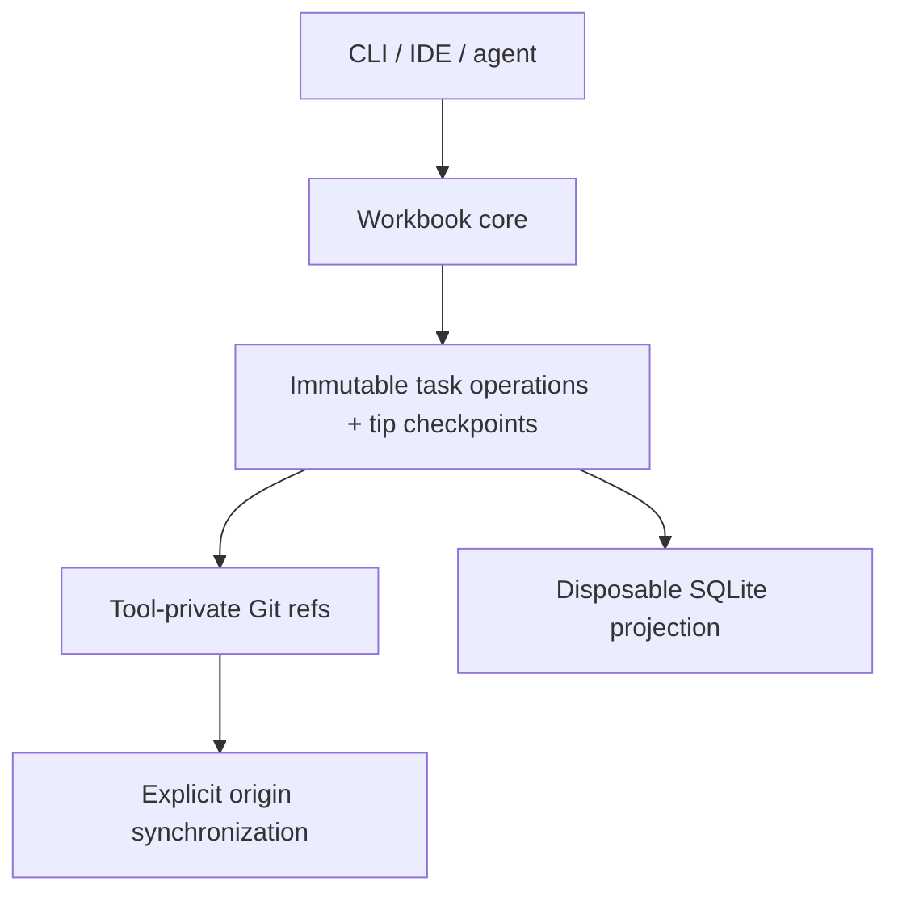

# Workbook architecture

How Workbook stores tasks in Git, keeps replicas synchronized, and projects
state into SQLite. For the command surface, see
[reference.md](reference.md).


Workbook separates its data model, transport, and query engine:



| Layer | Responsibility |
| --- | --- |
| Operation model | Defines task history, current tip checkpoints, causality, and validation |
| Git refs and objects | Store task operations durably and explicitly synchronize task refs with `origin` |
| SQLite projection | Materializes current task state and recorded operations for local reads; Git remains canonical |
| CLI/core library | Currently owns initialization, local validation, CRUD, and user-facing output |
| Optional adapters (proposed) | IDE integrations, local API, MCP, or a coordination relay |

Workbook adds only tracked bootstrap configuration to the working tree. Task state
does not live on the currently checked-out code branch.

## Git storage model

Each task owns a custom Git ref:

```text
refs/workbook/tasks/TASK-123
refs/workbook/tasks/TASK-456
```

The ref points to a Git **commit object**. That commit is the current head of the task's operation DAG:

```text
ref
 └── commit
      ├── parent commit(s)
      └── tree
           ├── operation.json blob
           ├── state.json blob
           └── attachment-<ULID> blob   (only on a commit that attached a file)
```

- The root commit has no parents and contains `task.create`.
- A normal edit commit has one parent.
- A future reconciliation or resolution commit can have multiple parents.
- Immutable `operation.json` packs are the authoritative record of task intent,
  and Git parent ancestry is the authoritative record of causality.
- Every commit tree contains the edit's versioned operation pack in
  `operation.json` and a deterministic, durable task materialization in
  `state.json`. A commit that attached a file also carries that file's bytes as
  a blob named for the attachment, and the checkpoint records the blob's object
  ID so reading an attachment costs one object read rather than a tree walk.
- An attachment's bytes are reachable **only** through their own task's ref
  history. There is no shared attachment store and no cross-task deduplication:
  two tasks attaching identical bytes each carry the blob in their own commit,
  and Git storing one object for both is a property of content addressing rather
  than a dependency between the two histories. A future compaction verb depends
  on this — it can offer to strip one task's attachments by rewriting that
  task's history without reasoning about any other task.
- Removing an attachment hides it and reclaims nothing. The bytes stay in the
  commit that added them, because that commit is shared append-only history that
  no clone may rewrite. Space comes back only when compaction rewrites the
  task's history.
- The durable model requires each `state.json` checkpoint to match the result of
  applying that commit's operation pack to its parent state, or to no parent
  state for a root commit.
- Ordinary `list`, `show`, `fetch`, and `sync` validate and use current tip
  checkpoints without replaying the complete history. This bounded default does
  not change the authority of immutable operations or Git ancestry.
- Reading a task's operation history — for the projection's `operations` table
  and for `workbook show --history` — reads the operation packs alone and does
  not revalidate their documents, tree shape, or stored checkpoints. The write
  path already prevents this clone from recording an invalid commit, and setup,
  sync, and fetch validate what arrives from elsewhere, so revalidating a whole
  history on every read buys nothing and makes a read scale with history depth.
  An unreadable commit truncates the read softly: the valid prefix is returned
  and the boundary commit is named.
- `workbook validate` explicitly replays history and reconstructs checkpoints;
  it is not part of ordinary current-tip reads or synchronization, and it
  remains the path that audits stored checkpoints.

Using one ref per task avoids a single global state-branch bottleneck: local
commands working on different tasks update different refs. Future concurrent edits
to the same task can form branches in that task's operation DAG and will require
the proposed domain reconciliation rules.

### Operation pack

Each task mutation creates one versioned operation pack. A pack can hold multiple
operations that should be applied atomically:

```json
{
  "format": "workbook.operation-pack",
  "version": 1,
  "projectId": "01K0M65GBZ8F5ZQX0VC1J8H3TP",
  "taskId": "WB-01K0M6B8A4FTT8C39MXXYTW7C1",
  "historyGeneration": "01K0M6B8A4FTT8C39MXXYTW7C2",
  "actor": {
    "id": "agent-7"
  },
  "logicalClock": 2,
  "wallTime": "2026-07-22T14:35:00-04:00",
  "operations": [
    {
      "id": "01K0M6B8A4FTT8C39MXXYTW7C3",
      "type": "field.set",
      "field": "status",
      "value": "ready"
    }
  ]
}
```

Operation IDs are globally unique and independent of Git object IDs. Git commit ancestry provides causal ordering; a logical clock assists validation and deterministic presentation. Wall-clock time is for display only and must not decide semantic conflicts.

The format supports task creation, scalar and label updates, dependency edges,
tombstones and restores, and assignments. Later CLI and format work is expected
to add:

- `comment.add`;
- `implementation.link` for associating work with code commits.

The lease-and-claim operations this section used to list — `claim.acquire`,
`claim.release`, and heartbeats — were dropped rather than deferred. See
[Assignments](#assignments): a lock asks for the one thing a distributed,
append-only history resists, and the convergent collection it does resist
nothing at all turned out to be the better answer to the same problem.

Historical operation commits are immutable. Tasks are tombstoned rather than
deleting their refs. Shared task histories are never rebased or force-pushed. A
clone that diverged from `origin` replays its own unpublished operations onto
the fetched tip and parks the tip it replaced, which changes only local refs and
appends to the shared history.

### Assignments

An assignment says who is responsible for a task. It is a convergent
collection, exactly like labels: `assign.add` and `assign.remove` operations on
the task, concurrent additions from two clones both surviving, and no conflict
type of its own.

That is deliberate, and it is the answer to a problem a lock cannot solve here.
Two agents working a queue in parallel will sometimes pick the same task. Under
a lease, they fight: each takes the lock, each loses it, and the loop has no
terminating state. Under a collection, they stop instantly in the both-assigned
state — which is a spike, a legitimate working mode, and a thing a person can
read off the board and act on. Assignment signals responsibility, never strongly
blocks, and is always overrideable by addition.

**The value.** An assignment names a *principal* — the asserted Git identity,
`user.email`, already stamped on every operation — optionally qualified by a
free-form *agent label*:

```
dylan@example.com
dylan@example.com/impl-1
```

There is no roster and no verification protocol; verifying identity would import
the central authority Workbook deliberately lacks, and within its trust model
(push access is trust) an asserted identity is exactly as strong as everything
else in a fetched ref. A wrong address is visible noise, corrected socially.

**What is stored.** The checkpoint materializes the live list, ordered by
principal and then label so that every clone folding the same history writes the
same bytes. The member is omitted when the list is empty, which is what leaves
every task document ever written unchanged:

```json
"assignments": [
  {
    "principal": "dylan@example.com",
    "label": "impl-1",
    "creator": "sam@example.com",
    "createdAt": "2026-08-13T14:35:00-04:00"
  }
]
```

`creator` and `createdAt` come from the pack that recorded the assignment. They
are stored rather than derived because they are the removal rule's evidence, and
that evidence has to live in the history every clone folds.

**The removal rule.** An assignment may be removed only by its
assignee-principal — any actor whose email matches, whatever agent label the
assignment carries — or by the actor who recorded it. The first clause lets an
orchestrator sweep up after its own fleet, including agents that crashed; the
second lets a mistaken tag of a teammate be undone by whoever made it.

It is enforced twice, and the second time is the one that matters:

- **At the mutation boundary**, a foreign removal is refused with category
  `validation` (exit `5`) and a message naming who may make it. Nothing is
  written.
- **In the fold**, `Apply` treats a foreign removal as a recorded no-op: the
  operation stays in the history, attributed to whoever wrote it, and changes
  nothing. This is what makes the rule a data-model contract rather than a
  courtesy of one code path. A pack built with `git hash-object`, written by a
  modified build, or pushed by a peer running something that is not Workbook at
  all folds to the same task on every honest reader.

The fold decides from the pack's actor and the assignment's own recorded
principal and creator, and from nothing else — no local identity, no clock, no
configuration. A no-op rather than a refusal, because refusing would make one
hostile pack a permanent `corrupt-data` verdict on a ref every clone has already
fetched, which is a denial of service dressed as strictness.

Adding an assignment that already exists is idempotent, and keeps the original
attribution, so a redelivered pack cannot rewrite who assigned whom. Removing
one that is not there is refused at the boundary — where it is a mistake
somebody can fix — and tolerated in replay, where it is already history.

**Ceilings.** A principal is bounded at 254 bytes (the longest deliverable
address) and a label at 100. How *many* assignments a task may carry is checked
only where somebody is adding one, never in the fold: two people assigning
themselves the same task on the same afternoon can carry it past any count
without either operation being anything but ordinary, and a fold that failed on
a count would make that pair of acts a task no clone could ever read again.

### Mixed Workbook versions

A team does not upgrade all at once, and a task ref is shared history: the
newest clone's writes reach the oldest clone's fetch immediately. From v0.5.0
on, Workbook distinguishes *this history was written by a newer Workbook* from
*this history is corrupt*, because the two need opposite responses — one is
fixed by upgrading, the other by repairing a repository.

**The marker.** An operation pack — a task pack or a configuration-ledger pack —
may carry an optional integer member, `minReader`, naming the lowest
writer-format generation that can fold it:

```json
{"format":"workbook.operation-pack","version":1,"minReader":1, …}
```

Absence means generation 0, and the member is set **per operation type** rather
than per release:

| Generation | Operations |
| --- | --- |
| 0 | `task.create`, `field.set`, `set.add`, `set.remove`, `task.tombstone`, `task.restore` |
| 1 | `assign.add`, `assign.remove`, `comment.add`, `comment.edit`, `comment.remove`, `attachment.add`, `attachment.remove` |

Generation 0 is every operation type Workbook shipped before assignments, and it
is the only generation that writes no marker. So a create, a field change, a
label, a dependency, a tombstone and a restore all still write nothing: every
document written before generation 1 existed — and every document written after
it by a command that neither assigns nor comments — is unchanged, byte for byte,
and golden tables covering every verb assert exactly that. Setting the member
per operation type is what keeps an older clone folding everything it genuinely
can: a task goes out of its reach at the commit that assigns, comments on, or
attaches to it, and not before.

The task and configuration checkpoints beside the packs carry the same member,
as a running maximum over the history so far. That is what lets a reader answer
"can I fold this task at all?" from one object rather than a walk of the chain.

**What an older clone does with one.** Scoped to the one task, or the one
configuration ledger, that carries it:

- **Reads work.** `list`, `board`, `show`, `next` and the web board serve the
  task from its stored checkpoint, which is where every read gets a task from
  anyway. The projected task carries `newerWriter: true`, and the CLI prints a
  non-fatal advisory beside the answer.
- **Mutations are refused**, with category `newer-writer` (exit `9`) and a
  message naming the task and saying to upgrade Workbook. Configuration changes
  are refused the same way when the ledger carries the marker; resolving a
  status against it still works, so boards still have columns and tasks can
  still be filed under statuses that already exist.
- **`workbook validate`** reports it as `newer-writer`, per task, and never as
  `corrupt-data`. It exits `9` rather than `0`: `validate` answers whether this
  clone can vouch for its history, and for these tasks it could not check. If a
  task is *also* genuinely corrupt, corruption is reported first — it is the
  more serious claim.
- **Synchronization never wedges.** Refs advance, other tasks are unaffected,
  and a clone with nothing local on the task simply fast-forwards onto the newer
  tip.

**Divergence is the hard edge**, and the answer is deliberate. If a clone has
unpublished operations on a task whose `origin` history has since gained a
newer-generation pack, replay is impossible by definition: the local operations
would have to be folded onto a checkpoint whose rules this build does not have.
Workbook **refuses the replay and changes nothing**. The task's ref is left
exactly where it is, holding every local operation; `origin`'s tip waits in the
tracking namespace; the task is reported as `needs-upgrade` and the run exits
`9`. That task is also not pushed, because `origin` already holds a tip the
local ref is not a descendant of and the push could only be rejected. Nothing is
parked, because nothing was replaced, and nothing is lost — the operations
publish themselves on the first sync after the upgrade. The configuration ledger
behaves identically.

**An unknown operation type with no marker is still `corrupt-data`.** That is
the whole point of the marker: without one, a type nobody recognizes is
tampering or a bug, not a version skew, and telling somebody to upgrade their
way out of a broken ref would be wrong. A marker at or below the reader's
generation changes nothing at all.

**The commit's tree is judged by the same rule, and after the marker.** A
generation may add entries to a commit tree — generation 1 did, for attachment
blobs — so tree shape is checked only once the pack beside it has been decoded,
and skipped entirely when the pack declares a generation the reader cannot fold.
What holds at every generation is that `operation.json` and `state.json` are
there as regular blobs, because a reader that cannot find the checkpoint cannot
serve the task at all. An entry a reader does not recognize *at its own
generation* is still `corrupt-data`; one under a newer marker is simply not that
reader's to judge. Checking it any earlier would have put a wall in front of the
next format change in the very place the marker exists to remove one.

**Before v0.5.0 there is no signal**, and honesty about what that costs matters
more than the reassurance. Installed binaries are frozen; v0.4.4 and earlier
predate the marker entirely, and their behavior against a newer pack is whatever
it is. The measured record from the PR #95 review is two different failures:
a pack using a custom status blocks the ref at fetch time, permanently, and
keeps stale data until the clone is upgraded; a restore-with-destination pack
reads, synchronizes and mutates fine but fails `workbook validate` for that one
task, permanently, as `corrupt-data`. Neither is repairable from the newer side,
because the history is already written and append-only. v0.5.0 is the last
release that can carry this hard edge, which is why the signal ships in it.

The marker is a claim made by whoever wrote the pack, and it is trusted for the
same reason every other field in a fetched ref is: anyone with push access can
already write a ref this clone refuses. What the marker changes is which message
that produces, not who is trusted.

## Concurrency and synchronization

Explicit synchronization, a combined fetch-then-push sync command, and
replay-based reconciliation of divergent task histories are implemented. The
model is:

1. Fetch the relevant Workbook ref.
2. Replay any local-only operation packs onto the fetched tip.
3. Validate the requested transition against the projected task.
4. Write an operation pack and Git commit.
5. Atomically advance the local task ref.
6. Push that task ref.
7. If the remote changed concurrently, the next fetch replays onto its new tip.

Most operations converge because they touch different fields. Meaningful
contradictions are surfaced rather than silently hidden, through the three
conflicts described in
[Reconciling divergent histories](reference.md#reconciling-divergent-histories). Concurrent
`done` and `in-review` status changes are not among them: status is
last-syncer-wins, and multi-value status conflicts remain proposed.

Exclusive claims are different. When `--remote-required` is used, a claim succeeds only after the remote accepts a fast-forward update based on the task ref that was fetched. If another agent claimed the task first, Workbook refetches and reports that the claim failed instead of merging two exclusive claims. Offline claims, if supported, must be visibly tentative.

Workbook does not rely on Git hooks for correctness. The optional managed
pre-push hook publishes task refs as a convenience, but fresh clones, alternate
Git clients, and remote PR merges cannot be assumed to execute it.

## Relationship to code branches

Implementation links and landed-state reporting are proposed; the current POC
does not implement them. The intended model keeps workflow state and code
availability as separate facts.

A task operation can record an implementation commit, while Workbook computes whether that implementation is reachable from the current branch or the configured target branch. This supports states such as:

- implemented on a feature branch but not landed;
- landed on `main`;
- done globally but absent from the currently checked-out historical branch.

Commit trailers provide a stable link across squash merges and cherry-picks:

```text
Task: TASK-123
```

Facts Git can derive, such as whether work has landed on `main`, should not be duplicated as mutable tracker state.

## SQLite projection

SQLite is a local, disposable read cache, never the canonical source of truth.
The shared cache is stored at `<git-common-dir>/workbook/cache.sqlite`, so linked
worktrees use the same projection. It materializes current task state, including
labels and dependencies; direct SQL writes and arbitrary SQL query support are not
part of the Workbook interface.

Before normal task reads (`list`, `show`, `board`, `next`, and web `GET
/api/tasks`), Workbook validates the cache against current Git task heads and
refreshes changed checkpoints. Create, update, and other mutations continue to
write Git operations directly. Run `workbook rebuild` to explicitly recreate the
cache; it builds a temporary database, checks task heads again, retries once if
they changed during the build, and atomically installs a stable result. With
`--json`, the normal result envelope contains `taskCount` and `cachePath`.

An `operations` table alongside the task tables materializes each task's recorded
operations for `workbook show --history`, `--compare`, and web
`GET /api/tasks/<id>/history`. Its rows are keyed on
the operation ULID rather than the commit object ID, because replay preserves
operation ULIDs while rewriting logical clocks and therefore every downstream
object ID; a surviving row changes only its ordering and object-ID columns. Rows
hold operations alone, with no per-row state checkpoint: any state is
reconstructed by replaying from the root.

Because comparing tips is complete for current state but blind to intermediate
commits — a fetch advancing a task twelve commits yields one new tip and eleven
unread packs — refresh walks each changed task from the head the projection
already holds to its new one, and a rebuild reprojects full histories. A new head
that does not descend from the projected one is the reconciliation signal: replay
drops operations three ways, so upserting alone would strand rows and break the
logical-clock chain a root-first replay depends on. Workbook deletes that task's
operation rows and reprojects the returned chain instead. Refresh and rebuild
therefore scale with operation count rather than task count, as the
projection-refresh benchmark family measures.

The cache can be deleted at any time and rebuilt entirely from Workbook refs.
Semantic validation results live in a separate `validation.sqlite` beside it, so
a validator-version bump does not force a projection rebuild and a long
validation pass does not hold the projection's writer lock against mutations.

## Bootstrap and portability

A normal Git clone does not fetch arbitrary custom ref namespaces, so bootstrap
stays explicit. Installing Workbook is a separate step: `brew install
dgoings/tap/workbook`, or `./scripts/install.sh` to build from source.

`workbook setup` then performs the repository half of the bootstrap:

1. detect the repository and validate Git identity;
2. resolve the project identity — adopt `origin`'s `refs/workbook/project` if it
   publishes one, otherwise the identity ref, tracked configuration or private
   guard this checkout already has, and only then mint a new one — publishing
   `refs/workbook/project` and writing `.workbook/config.json` when it is absent;
3. repair or write the private common-directory guard from that identity;
4. write the user-global configuration file when it is missing;
5. install or refresh managed agent documentation and the project-local Workbook skill;
6. explicitly fetch and publish `refs/workbook/project` and `refs/workbook/tasks/*`
   through `origin`, or report that synchronization was skipped when no remote is
   configured;
7. report which record the identity came from, and the resulting task count.

Setup deliberately does not install Git hooks. Hooks remain opt-in through
`workbook hooks install`, because they must never be required for correctness.

The default shared backend uses custom refs because they avoid branch switching and per-repository head contention. A conventional `workbook/state` branch may be offered as a compatibility fallback for Git hosts that reject custom refs. A future optional relay may provide strict leases, heartbeats, notifications, or high-concurrency agent coordination while retaining the same operation model.

## Design principles

- **Repository-native:** use the existing Git repository and remote.
- **Local-first:** remain useful offline; synchronize explicitly and transparently.
- **CLI-first:** every capability is available without a GUI or long-running server. A watcher makes synchronization cheaper; it never becomes required.
- **Agent-friendly:** stable semantic commands and machine-readable output minimize context and token use.
- **Human-inspectable:** operation payloads use versioned, inspectable formats.
- **Derived when possible:** do not duplicate facts already represented by Git.
- **No hidden rewrites:** shared history is append-only and never force-pushed.
- **Progressive complexity:** no service is required for the default workflow; stronger coordination can be optional.

## Non-goals

At least initially, Workbook is not intended to provide:

- a hosted Jira or Linear replacement;
- organization-wide portfolio planning across many repositories;
- real-time collaborative rich-text editing;
- strict distributed leases without an online coordination authority;
- a required MCP server or IDE integration;
- field-level permissions beyond the repository's Git access controls.

